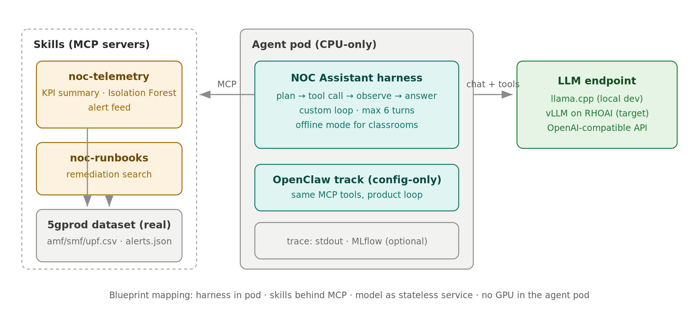
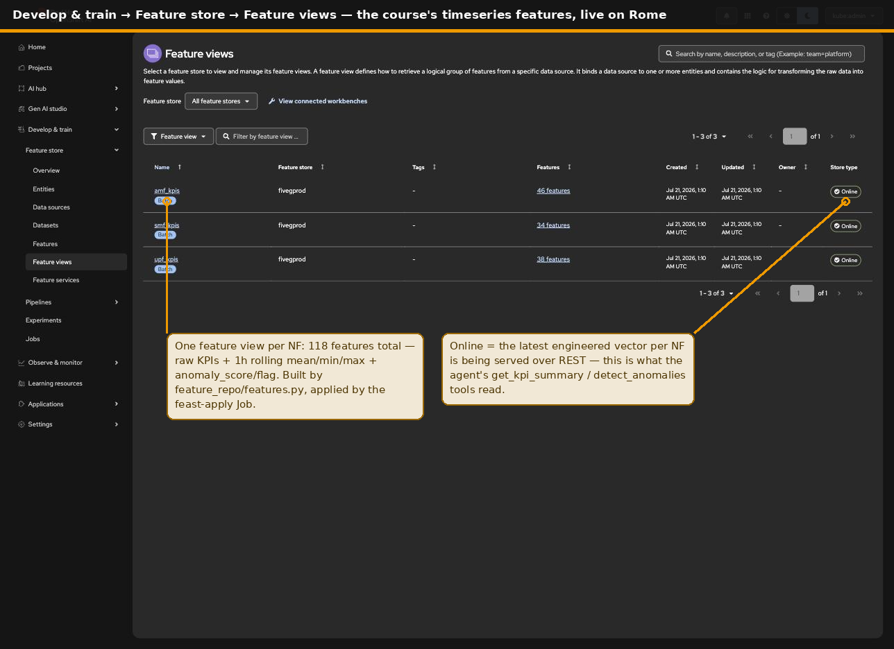
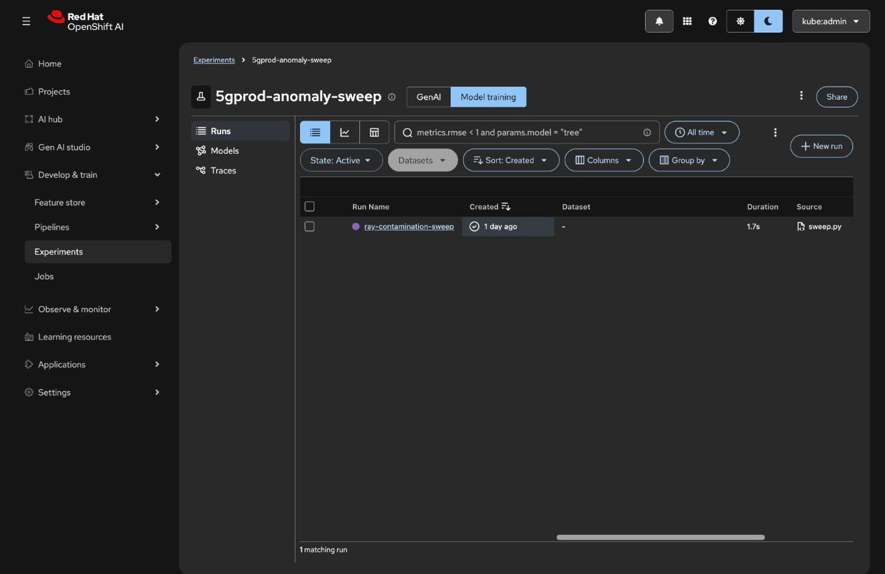
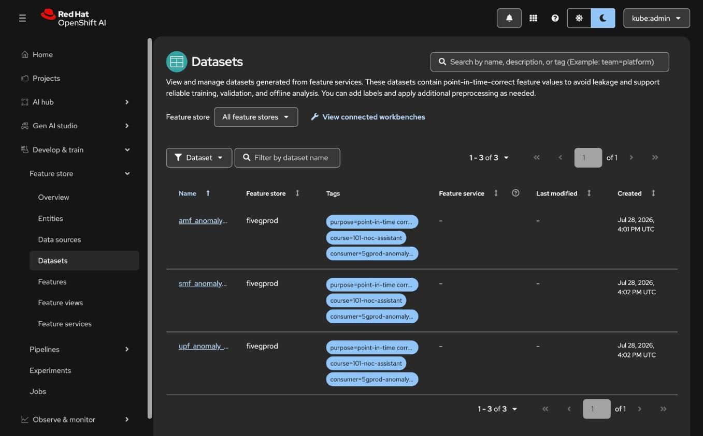
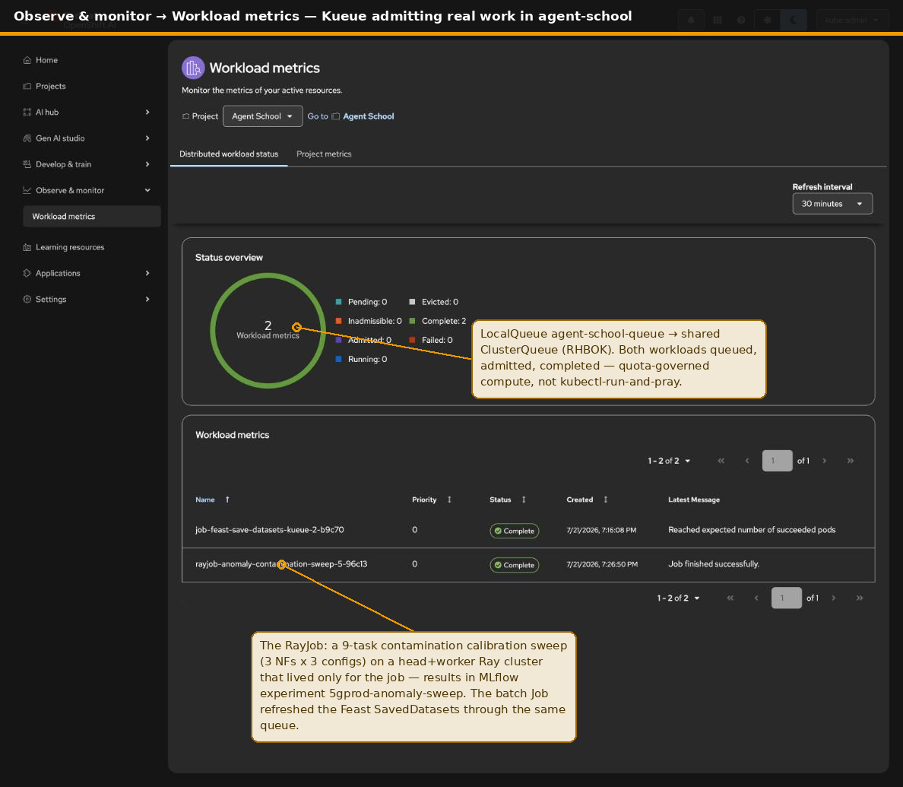
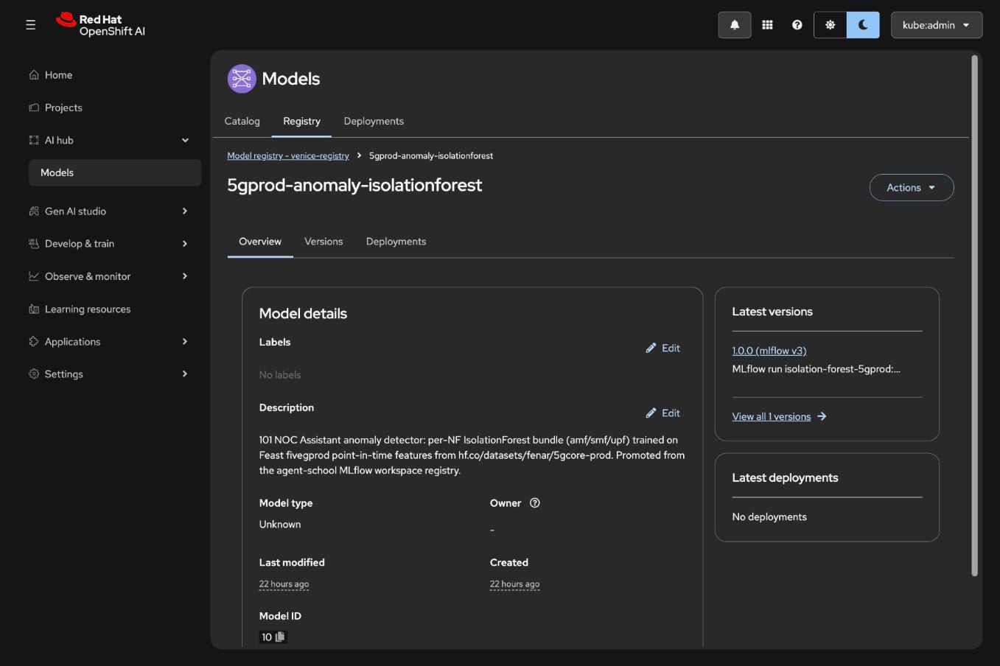
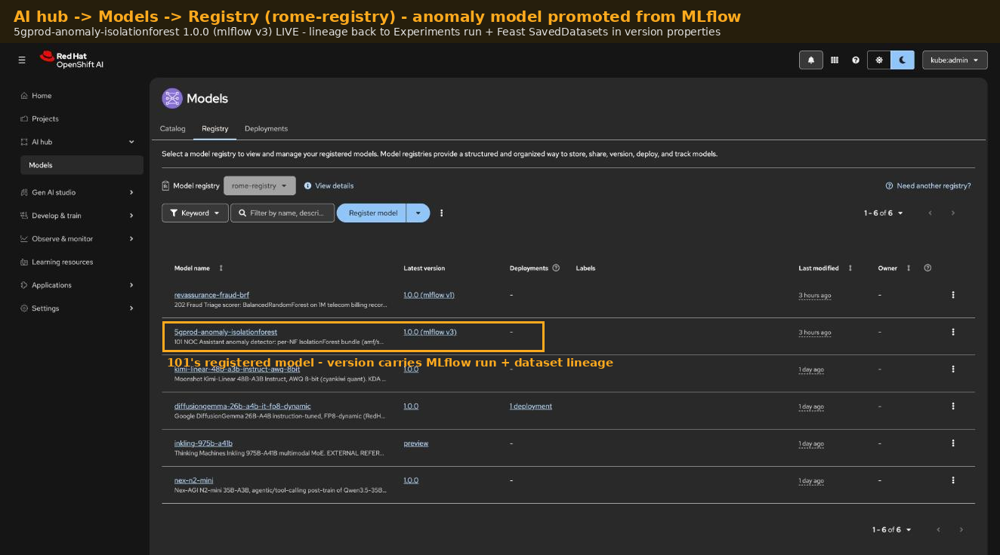
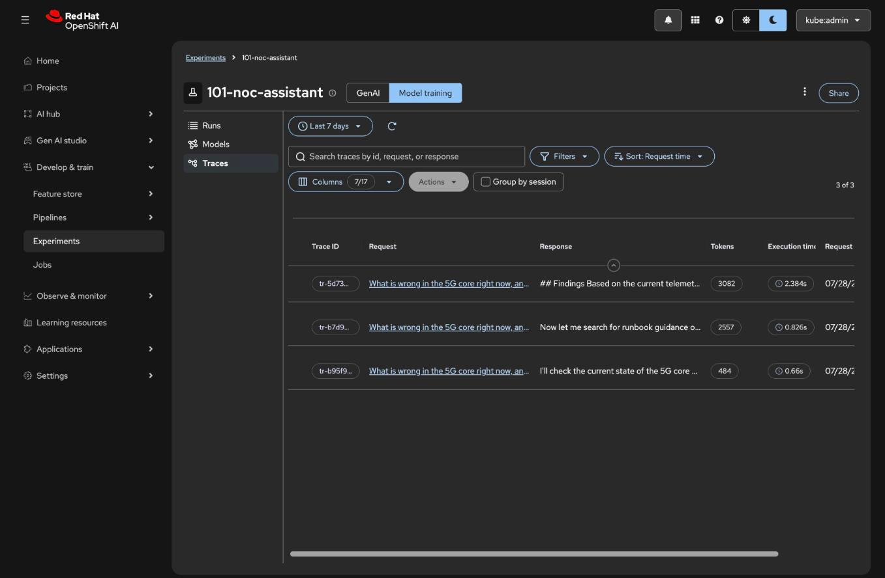

# 101 · NOC Assistant

> **QA status:** offline mode, MCP servers, mock loop, and two live runs
> against Red Hat OpenShift AI Model-as-a-Service (LiteLLM gateway,
> Qwen3.6-35B-A3B) all pass. Full evidence, including wire-level MaaS
> request/response captures, lives in [QA/](./QA/).

A single agent that answers NOC questions about a 5G core: it inspects telemetry, detects anomalies, and consults runbooks before answering. The "hello world" of agentic telco AI, except it already does real work.

**Source experiments:** [5gprod](https://github.com/open-experiments/Telco-AIX/tree/main/5gprod) (telemetry + NOC workflow), [telco-sme](https://github.com/open-experiments/Telco-AIX/tree/main/telco-sme) (domain knowledge access).

## What it teaches

1. The agent loop: plan, call a tool, observe, repeat, answer.
2. Tools as MCP servers: the agent's capabilities live outside the agent.
3. The model as a stateless service: any OpenAI-compatible endpoint works, vLLM on RHOAI is the reference path.
4. The data pipeline as a platform citizen: features in Feast, training in Experiments, the model versioned in a registry — not buried in a notebook.
5. Tracing: every step — agent turns *and* classical-model inference — lands in MLflow.

## Architecture



Read the drawing as three zones, because that is the packaging decision the
whole blueprint turns on:

- **The agent pod** ships only what the course owns: the harness loop, the
  two MCP skill servers, the runbooks, and a CSV copy of the dataset as the
  offline fallback. CPU-only, UBI9, restricted PSS, no secrets baked in.
  This is Agent-as-a-Workload: the pod is disposable, everything stateful
  lives behind a service.
- **Inside the cluster** the pod consumes platform services it does not
  carry: the Feast online store for live network state (⑤), vLLM for
  reasoning (⑥), MLflow for traces (⑦). The feature pipeline Jobs in the
  same zone keep those services truthful (①–④).
- **Outside the cluster** sit the published dataset the pipeline pulls
  from, the optional MaaS endpoint (same OpenAI-compatible contract, so
  swapping is a config change), and the learner laptop that runs the whole
  course offline with zero cluster access.

## The data pipeline, agentified

The [Telco-AIX](https://github.com/open-experiments/Telco-AIX) experiments
did this flow by hand in notebooks. Here it is the platform's job, and the
RHOAI dashboard shows each stage. All snapshots below are live captures
from the Rome cluster, not mockups.

**1 — Timeseries features in Feast.** `feature_repo/ingest.py` pulls
[fenar/5gcore-prod](https://huggingface.co/datasets/fenar/5gcore-prod),
engineers 1-hour rolling mean/min/max per KPI, lands the offline parquet,
and pushes the latest vector per NF online. One feature view per NF, one
`noc_telemetry` feature service:



**2 — Training as an experiment.** `training/train_anomaly.py` retrieves
the same features point-in-time from the offline store (no
training/serving skew by construction), trains an IsolationForest per NF,
and validates against the labeled alert windows in `data/alerts.json`:



**2b — The training set is a named artifact.** `feature_repo/save_training_datasets.py`
freezes that exact point-in-time retrieval as Feast SavedDatasets
(`amf/smf/upf_anomaly_training`, tagged with course + consumer model) —
**Feature store → Datasets** in the dashboard. A model version points
back to a named dataset, not an ephemeral dataframe:



**2c — Calibration as a queued, distributed sweep.** Training itself
stays a plain Job — an IsolationForest does not need a Ray cluster. What
*is* embarrassingly parallel is calibrating it:
`training/ray_contamination_sweep.py` fans nine configurations (3 NFs ×
3 contamination values) across an ephemeral Ray cluster (head + worker,
alive only for the job), scores each against the labeled alert windows
and the labeled incident rate, and logs the sweep to MLflow
(`5gprod-anomaly-sweep`, with the best pick per NF). The RayJob carries
the `kueue.x-k8s.io/queue-name` label, so RHBOK admits it against the
shared ClusterQueue before KubeRay spins up a single pod — the same
quota gate the Feast dataset Job goes through, visible in
**Observe & monitor → Workload metrics**:



The pattern — not the payload — is the point: 302's fine-tuning runs
ride this exact RayJob-on-Kueue rail, with GPUs in the worker group.
Wiring and EA2 findings (Kueue frameworks list, namespace opt-in label,
KubeRay's silent `oauth-proxy-sa` swap) are in
[deploy/ocp/rome/](./deploy/ocp/rome/): `kueue.yaml`,
`rayjob-anomaly-sweep.yaml`, `mlflow-workspace-rbac.yaml`.

**3 — A versioned model, not a pickle in a bucket.** The run logs one
pyfunc model that routes each row to its NF's forest, and registers it as
`5gprod-anomaly-isolationforest`. Lineage — dataset, feature source,
window, split — is all in the params:



**3b — Promoted to the shared registry.** The MLflow version is then
promoted into the cluster-wide `rome-registry` (**AI hub → Models →
Registry**) with custom properties carrying the lineage — source
MLflow run, Feast SavedDatasets, alert-window validation — so the
classical anomaly model sits in the same catalog as the platform's
LLMs, one governance surface for both:



**4 — Traced inference.** `ingest.py --score` runs the pipeline's anomaly
inference with the registered bundle and pushes `anomaly_score` /
`anomaly_flag` back online. Every scoring call is traced against the
logged model — the classical model gets the same observability as the
GenAI loop:



**5 — The agent serves the result.** With `FEAST_ONLINE_URL` set,
`tools/lib.py` answers `get_kpi_summary` from the online 1h aggregates and
`detect_anomalies` from the pipeline's model verdicts. Without it, the
bundled CSVs serve the same shapes — laptop learners need no cluster.

Cluster manifests for the pipeline Jobs live in [deploy/](./deploy/);
RHOAI 3.5 EA2 operational findings (registry persistence, PVC access
pattern, dashboard labels) are in
[feature_repo/README.md](./feature_repo/README.md).

## Blueprint mapping

| Blueprint component | Here |
|---------------------|------|
| Harness | `agent/noc_agent.py` custom tool-calling loop (any OpenAI-compatible endpoint) |
| Model | your endpoint via `LLM_BASE_URL` (vLLM / RHOAI MaaS) |
| Skills (thin clients) | `tools/lib.py` functions (Feast online client or CSVs, alert feed, runbooks) |
| Skill exposure | `tools/telemetry_mcp.py`, `tools/runbook_mcp.py` (MCP servers) |
| Feature store | Feast `fivegprod` (`feature_repo/`) — offline training set + online serving |
| Model lifecycle | MLflow Experiments → logged model → registered versions (`training/`) |
| Observability | stdout trace + MLflow traces (agent loop and pipeline inference) |

The classic-AI-then-GenAI chaining mirrors the source experiment: Isolation
Forest finds the anomalies, the alert feed scopes the incident, and the
language model reasons over both before answering.

## Run it

```bash
pip install -r requirements.txt

# Offline first: scripted episode over the real dataset, no endpoint needed
python agent/noc_agent.py --offline "What is wrong in the core right now?"

# Live: against any OpenAI-compatible endpoint
cp .env.example .env                      # set LLM_BASE_URL, LLM_API_KEY, LLM_MODEL
python agent/noc_agent.py "What is wrong in the core right now?"
```

To run the tools as standalone MCP servers (for MCP-native harnesses or a gateway in front):

```bash
python tools/telemetry_mcp.py             # stdio MCP server
python tools/runbook_mcp.py
```

## Data

`data/` carries the real Telco-AIX 5gprod dataset: 24 hours of per-minute
KPIs for AMF (registration, NAS/NGAP success, N1/N2 messaging), SMF
(session establishment, PFCP/N4 messaging, policy installation) and UPF
(packet processing, tunnels, throughput, drops, latency), plus a structured
alert feed with REGISTRATION_STORM, RESOURCE_EXHAUSTION and
SESSION_MANAGEMENT_FAILURE incidents and their before/during KPI deltas.
Source: [Telco-AIX/5gprod](https://github.com/open-experiments/Telco-AIX/tree/main/5gprod),
published at [huggingface.co/datasets/fenar/5gcore-prod](https://huggingface.co/datasets/fenar/5gcore-prod).
The runbooks in `runbooks/` are written against those three real alert types.

## Harness tracks

The agent above is the teaching harness: a custom loop you can read top to
bottom. The same skills run unchanged under product harnesses:

- [OpenClaw track](./harness-tracks/openclaw.md): register the two MCP
  servers and the RHOAI endpoint in `~/.openclaw/openclaw.json` and ask the
  same question through OpenClaw's own always-on loop. No agent code involved.
  The track also covers continuous 7/24 operation via OpenClaw heartbeat:
  periodic anomaly/alert sweeps that pick up fresh data from `data/`
  automatically, alerting a channel only when something needs attention.

## Deploy on OpenShift

UBI9 image, restricted-PSS manifests, Job for one-shot questions and a
suspended CronJob for the continuous sweep, plus the feature-pipeline Jobs
and the `rome` overlay wiring (Feast + MLflow endpoints): see
[deploy/](./deploy/).

## Where this goes next

The 101 agent *detects and explains*. In 201 the runbook lookup becomes a
real RAG skill backend and an LLM judge scores the agent's evidence
grounding. In 301 this same diagnostic capability becomes one worker in a
closed loop: the anomaly verdict this pipeline pushes online is handed to
an external MCP reasoning step for remediation-flow determination, and a
second agent executes the fix — the
[autonet](https://github.com/open-experiments/Telco-AIX/tree/main/autonet)
pattern. The agent code barely changes; the platform around it grows. That
is the point.
