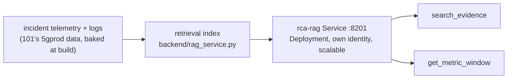
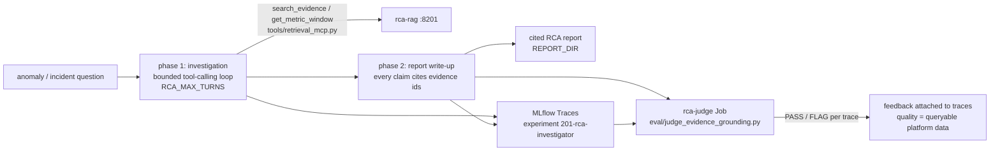

# Course 201 Execution Manual: RCA Investigator

A step-by-step guide for running the 201 Root-Cause-Analysis course. You will deploy a retrieval (RAG) backend as a separate service, run a multi-turn investigating agent as a Job, and grade its reports with an LLM judge, all traced in MLflow.

Every step has three parts: **Why** explains what the step is for and what it means in the architecture, **Do** gives the exact action, and **Expect** gives the success signal.

The course builds on the 101 environment. If you only want to study the result, use the "Just look at it" table.

## Just look at it (no deployment needed)

| What | Where |
|---|---|
| RAG backend | Console (`rome` or `venice`), project `agent-school`, Deployment `rca-rag` |
| RCA runs with both phases traced | RHOAI dashboard, Experiments, workspace `agent-school` (investigation + report write-up traces) |
| Judge feedback on traces | Same Experiments tab; each judged trace carries evidence-grounding feedback |
| Build | Console, Builds, `rca-investigator` |

## What you will build

Pattern 2 of the course series: the skill (the retrieval index) lives in its own Deployment (`rca-rag`), never in the agent pod, so it scales independently. The agent Job investigates an incident by calling tools against the backend and the LLM, then writes an RCA report with evidence citations. A separate judge Job scores the latest traces for evidence grounding, client-side, using the cluster's own Kimi model through LiteLLM.

The big ideas of 201 are **skills as services** (heavy capabilities live behind a Service boundary, not inside the agent) and **evaluation as a first-class workload** (you do not trust an agent's report, you grade it, and the grades attach to the traces).

## Inner mechanics — the three loops

201 keeps 101's platform and adds one discipline: reasoning you can defend. Three loops: an **evidence backend** that builds the searchable truth, a **two-phase investigation** that uses it, and a **judgment loop** that grades the result.

### Loop 1 · Evidence backend — build the searchable truth

The investigator works the same incident data the NOC assistant watches: 101's telemetry and alerts are baked into the image at build time (the build uses the repo root as context), which is exactly what lets a judge later check the evidence. At startup the [`rca-rag` Deployment](./backend/rag_service.py) builds its retrieval index and serves it over HTTP on 8201 — a **pattern-2 skill backend**: a real Service, not an in-process shim. It can scale to three replicas, be re-indexed, or be swapped for a vector database without the agent changing a line.



### Loop 2 · Investigation — two phases, every claim cited

One investigation is one Job. **Phase 1** is a bounded tool-calling loop ([`agent/rca_agent.py`](./agent/rca_agent.py), capped by `RCA_MAX_TURNS`, because unbounded agent loops are a cost and safety bug): the agent reaches its skill at `http://rca-rag:8201` through plain in-cluster service discovery and gathers correlated evidence. **Phase 2** writes the RCA report, and every finding must cite evidence ids like `[alert-5]` and `[amf-796]` — uncited claims are exactly what the judge exists to catch. The report lands in `REPORT_DIR` (an emptyDir by default; mount a PVC to keep it), and both phases are flushed to the `201-rca-investigator` experiment as MLflow traces, so the report's provenance is inspectable turn by turn.



### Loop 3 · Judgment — grade the grounding

Confident prose is worthless if it is not grounded, and no human reads every RCA. The [`rca-judge` Job](./eval/judge_evidence_grounding.py) pulls the latest traces from the workspace, asks the cluster's own Kimi (via LiteLLM's `hosted_vllm` provider — no external API, no data leaving the cluster) whether each claim is supported by its cited evidence, and writes the verdicts back as **feedback attached to the traces**. Evaluation results live next to the thing they evaluate. This is the first appearance of the evaluate-the-reasoning discipline: 302 turns it into a measured suite, and the resolution path stays human — a defensible, cited report is the deliverable, and 301 is where agents start acting on findings.

### Stage-to-code map

| Stage | Component | Where |
|---|---|---|
| Evidence base | retrieval index, built at startup | [`backend/rag_service.py`](./backend/rag_service.py), `rca-rag` Deployment + Service :8201 |
| Skill access | MCP retrieval tools over HTTP | [`tools/retrieval_mcp.py`](./tools/retrieval_mcp.py), [`tools/lib.py`](./tools/lib.py) |
| Investigation | two-phase bounded loop, one run = one Job | [`agent/rca_agent.py`](./agent/rca_agent.py), [`deploy/ocp/job-rca.yaml`](./deploy/ocp/job-rca.yaml) |
| Reasoning | in-cluster vLLM (Kimi), stateless | `llm-credentials` Secret |
| Report | cited RCA artifact | `REPORT_DIR` (emptyDir; see [`reports/`](./reports/) for QA examples) |
| Score control | both phases traced | MLflow Traces, experiment `201-rca-investigator` |
| Judgment | evidence-grounding judge, verdicts as trace feedback | [`eval/judge_evidence_grounding.py`](./eval/judge_evidence_grounding.py), [`deploy/ocp/rome/job-judge.yaml`](./deploy/ocp/rome/job-judge.yaml) |

## Prerequisites (verify before you start)

1. Everything from the 101 manual's prerequisites (RHOAI 3.5 EA2 stack, internal image registry configured, Kimi-Linear Ready in `telco-aix`, managed MLflow running).
2. Project `agent-school` exists with the `llm-credentials` Secret and `mlflow-tracking` ConfigMap (101 manual, Steps 1 and 2). The 201 overlay generates identical content, so run 101 first or create just those two objects from the 101 manual.

## Step 1: Base workload (backend + build + identity)

**Why:** this step separates the agent from its skill, which is the whole pattern. The **`rca-rag` Deployment** owns the retrieval index and serves it over HTTP on 8201: it can scale to three replicas, be updated, or be swapped for a vector database without the agent changing a line. The **ServiceAccount** gives the RCA agent its own identity, distinct from 101's agent, because per-agent identity is what makes per-agent governance possible. The **build** uses the repo root as context (unlike 101) because the image bakes in 101's telemetry data: the investigator works the same incident data the NOC assistant watches, which is what makes a judge able to check its evidence later. The RBAC file passes this identity through MLflow's workspace auth.

**Do (Console):** Import YAML, paste from `201-rca-investigator/deploy/ocp/base/`, in order: `serviceaccount.yaml`, `imagestream-buildconfig.yaml`, `rag-service.yaml`. Add `namespace: agent-school` under each `metadata:`. Then paste `201-rca-investigator/deploy/ocp/rome/mlflow-rbac.yaml`.

`oc` fallback: `oc apply -k 201-rca-investigator/deploy/ocp/rome`

**Console:** Builds, BuildConfigs, `rca-investigator`, Actions, Start build.

**Expect:** build **Complete** in 3 to 6 minutes; then the `rca-rag` pod goes Running and Ready (it serves `/healthz` on port 8201). The Service `rca-rag` exposes port 8201.

## Step 2: Run an investigation

**Why:** same discipline as 101 (one investigation = one Job), but the run is now a **two-phase** agent: a tool-calling investigation loop (bounded by `RCA_MAX_TURNS`, because unbounded agent loops are a cost and safety bug) followed by a report write-up phase. The agent reaches its skill at `http://rca-rag:8201`, plain in-cluster service discovery; nothing about agent-to-skill calls needs special machinery. The report cites evidence ids for every claim, and that is deliberate: uncited claims are exactly what the judge in Step 3 exists to catch. The full run, both phases, lands as traces in MLflow, so the report's provenance is inspectable turn by turn.

**Do (Console):** Import YAML, paste `201-rca-investigator/deploy/ocp/job-rca.yaml`, add `namespace: agent-school`. (Uses `generateName`; with a terminal: `oc create -f 201-rca-investigator/deploy/ocp/job-rca.yaml`.)

**Expect:** the `rca-run-...` pod completes in 2 to 4 minutes. Its log shows the tool-calling investigation followed by a written RCA whose findings cite evidence ids like `[alert-5]` and `[amf-796]`. Both phases are flushed to the `201-rca-investigator` experiment as MLflow **traces** (Traces tab), not runs — the runs list stays empty, and that is expected. In the replay portal you see the experiment card; browse the traces themselves on a live cluster.

The report also lands in `REPORT_DIR` (an emptyDir by default; mount a PVC in the Job if you want reports to outlive the pod).

## Step 3: Judge the evidence grounding

**Why:** an agent that writes confident prose is worthless if the prose is not grounded, and no human reads every RCA. The judge is therefore another workload: it pulls the latest traces from MLflow, asks the cluster's own Kimi model (via LiteLLM's `hosted_vllm` provider, so no external API and no data leaving the cluster) whether each claim is supported by the cited evidence, and writes its verdicts back as **feedback attached to the traces**. Evaluation results living next to the thing they evaluate is the point: quality becomes queryable platform data, not a spreadsheet. It runs client-side as a Job because the EA dashboard's server-side judge runner 404s/401s under workspace scoping, which is also a useful lesson: when a managed path breaks, the workload pattern gives you a supported fallback.

**Do:**

```
oc create configmap rca-eval-src -n agent-school \
  --from-file=judge_evidence_grounding.py=201-rca-investigator/eval/judge_evidence_grounding.py
```

**Console:** Import YAML, paste `201-rca-investigator/deploy/ocp/rome/job-judge.yaml`.

**Expect:** Job `rca-judge` completes in 2 to 3 minutes and its log ends with `logged feedback for 3 traces`. On a live cluster, open Experiments, Traces tab and inspect any judged trace: the evidence-grounding assessment is attached as feedback (traces, not runs — the runs list stays empty).

## Step 4 (optional): Small-vs-large model routing

*The interactive lab tape covers Steps 1–3; this optional step runs on a live cluster only.*

**Why:** the two phases have different quality needs: investigation is many cheap tool-calling turns, the report is one careful long-form generation. The agent supports routing each phase to a different endpoint (`LLM_MODEL_SMALL` / `LLM_MODEL_LARGE`), and the overlay leaves both unset so a single Kimi serves everything. Wiring a second model in makes the cost/quality tradeoff a config decision, which is where it belongs.

**Do:** deploy a second model, set the two variables in `job-rca.yaml`'s env, and re-run Step 2.

## Troubleshooting

- `rca-rag` CrashLoop or never Ready: check the build completed and the image exists in the ImageStream; the readiness probe needs `/healthz` to answer on 8201.
- Judge job cannot list traces: the judge runs under the `rca-investigator` SA on purpose; it needs `mlflow-rbac.yaml` from Step 1 (MLflow authorizes with a SubjectAccessReview on the workspace).
- Any build stuck in `New`: internal registry not configured; see the 101 manual, prerequisite 2.

## Cleanup

Delete the run and judge Jobs (or wait for TTL). `rca-rag` keeps serving; scale it to zero if you want the project quiet.
