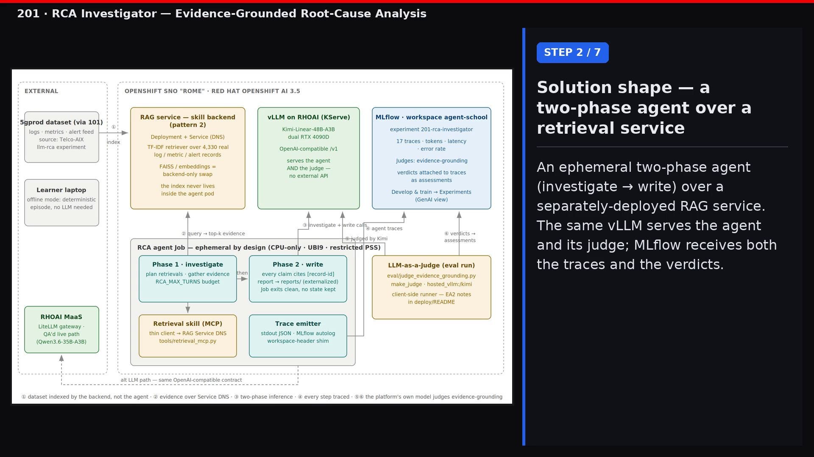
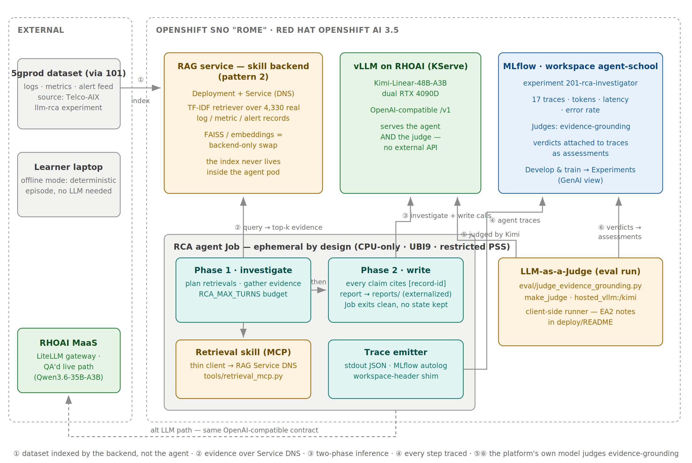
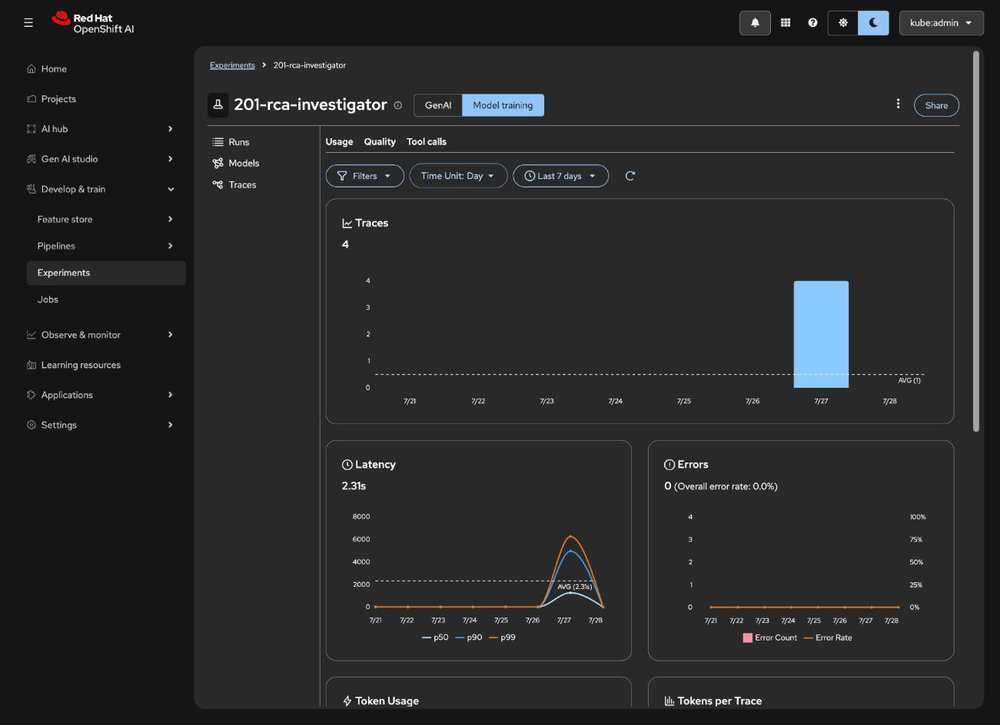
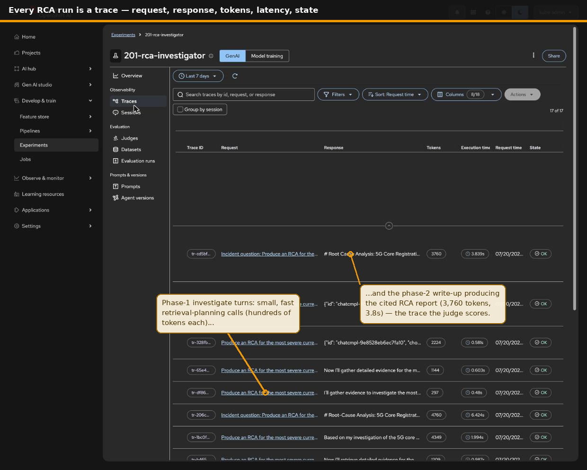
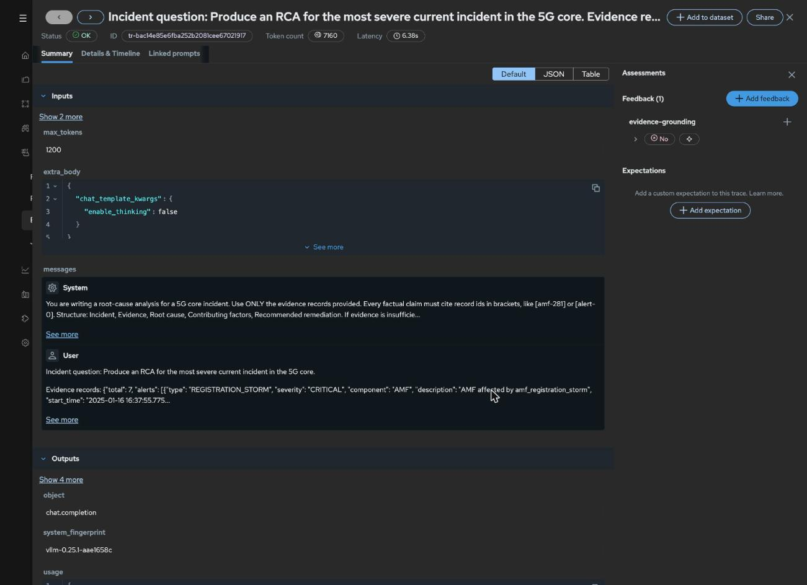

# 201 · RCA Investigator

> **QA status:** working. RAG backend (4,330 real documents), offline
> episode, and a live two-phase run against RHOAI MaaS (Qwen3.6-35B-A3B)
> all pass; the live run produced a fully cited RCA report. Evidence and
> wire traces in [QA/](./QA/).

A research agent that turns an anomaly into an evidenced root-cause report:
it retrieves correlated logs and metrics from a vector-store backend, reasons
over them, and writes an RCA where every claim cites a retrieved record.

**Source experiment:** [llm-rca](https://github.com/open-experiments/Telco-AIX/tree/main/llm-rca)
(Classic-AI → GenAI model chaining with FAISS log association), reusing the
5gprod dataset and the per-NF vector stores its `preprocess_data.py` builds.

**Harness:** custom two-phase loop (teaching; same OpenAI-compatible client
101 uses, here split into investigate and write phases); Hermes Agent track
planned (product harness over the same MCP skills).

## Walkthrough video

A narrated walkthrough (4:20) — the problem, then the step-by-step agentic
solution over the live RHOAI portal on our DevOps cluster called Rome.
Click the poster to play or download:

[](./images/201-rca-investigator.mp4)

## Architecture



The zones carry 201's packaging lesson. The agent pod is an ephemeral Job:
two phases, a thin retrieval client, a trace emitter — and nothing else.
The index it depends on lives in a separate in-cluster Deployment (the RAG
service, pattern 2), so re-indexing, retriever swaps, and scaling never
touch the agent. The same cluster zone provides vLLM (which serves both
the agent and its judge) and MLflow (which receives both traces and
verdicts). External stays external: the source dataset, the MaaS alt
path, and the offline laptop mode.

## Solution flow

1. An anomaly event arrives (the same telemetry tools 101 built; the
   Isolation Forest output is the trigger).
2. The agent plans a retrieval: which NF, which incident window, which
   evidence it still lacks.
3. The retrieval MCP tool queries the RAG service backend, a separately
   deployed FAISS vector-store service (pattern 2); the index never lives
   inside the agent pod.
4. Inference is Tier-2 routed: a small model summarizes retrieved chunks
   cheaply, the large model writes the causal analysis.
5. The agent emits the RCA report to external storage, with citations back
   to the retrieved records, and the session ends clean.
6. After the run, an LLM judge scores the report's evidence-grounding and
   attaches the verdict to the trace — quality is measured, not assumed.

## Observability and evaluation on RHOAI

Live captures from the Rome cluster (Develop & train → Experiments →
`201-rca-investigator`), not mockups.

The agent needs no bespoke telemetry code — `mlflow.openai.autolog()`
plus the workspace shim, and every LLM call becomes a trace with token
and latency accounting:



The trace list shows the two-phase economics directly — many small
investigate calls, one large cited write-up:



And the write-up trace carries its judge verdict as an assessment. The
`evidence-grounding` judge runs on the cluster's own Kimi-Linear via
`hosted_vllm` (`eval/judge_evidence_grounding.py`) — verified both ways:
the cited report scores **yes**, a tool-loop trace with no report scores
**no**. RHOAI 3.5 EA2 findings on the dashboard's server-side judge
runner are documented in [deploy/](./deploy/):



201 deliberately adds no new data infrastructure: the judge runs as a
one-shot in-cluster Job and everything lands in the same workspace
MLflow that 101 set up — the platform investment amortizes across
courses instead of each one growing its own stack.

## Blueprint mapping

| Blueprint component | Here |
|---------------------|------|
| Harness | `agent/rca_agent.py` two-phase loop in the pod (investigate → write) |
| Skill backend (pattern 2) | FAISS RAG service from llm-rca |
| Inference routing | small model for summaries, large for write-up |
| Ephemeral sessions | report externalized, no state in the loop |
| Observability | stdout trace + MLflow autolog (tokens, latency, per-call traces) |
| Evaluation | LLM-as-a-Judge `evidence-grounding` on the platform's own served model (`eval/`) |

## What it teaches

1. RAG as a skill backend, not an in-process index.
2. Cost-aware model routing inside one agent task.
3. Evidence discipline: ungrounded sentences are bugs.
4. Evaluation as platform data: judge verdicts live on the traces they
   score, produced by the same vLLM endpoint the agent uses — no external
   grading API.

## Run it

```bash
pip install -r requirements.txt
uvicorn backend.rag_service:app --port 8201 &   # RAG backend (pattern 2)

python3 agent/rca_agent.py --offline             # deterministic, no LLM
cp .env.example .env                             # then live:
python3 agent/rca_agent.py "Produce an RCA for the most severe current incident."
```

The report lands in `reports/` with record-id citations. Knobs:
`RCA_MAX_TURNS` (investigation budget), `RCA_REPORT_MAX_TOKENS` (report
budget), `RCA_DISABLE_THINKING` (Qwen hybrid-reasoning off for the write-up;
see QA/README findings). Requires `../101-noc-assistant/data/` (ships with
the repo) or set `DATA_DIR`.

The retriever is TF-IDF for dependency-light classrooms; the source llm-rca
experiment used OpenAI embeddings + FAISS, and swapping the `Retriever`
class is a backend-only change, which is the pattern-2 lesson.

For MCP-native harnesses (the Hermes track, or a gateway in front), the same
skills are exposed as a stdio MCP server:

```bash
python3 tools/retrieval_mcp.py
```

To judge the latest traces (needs the `MLFLOW_*` and `HOSTED_VLLM_*` envs
of the rome overlay):

```bash
python3 eval/judge_evidence_grounding.py --latest 3
```

## Deploy on OpenShift

One image, two roles: the RAG backend as Deployment + Service, each RCA as
a Job calling it over Service DNS. The `rome` overlay adds the MLflow
tracking wiring and the judge's vLLM endpoint config. See
[deploy/](./deploy/).
