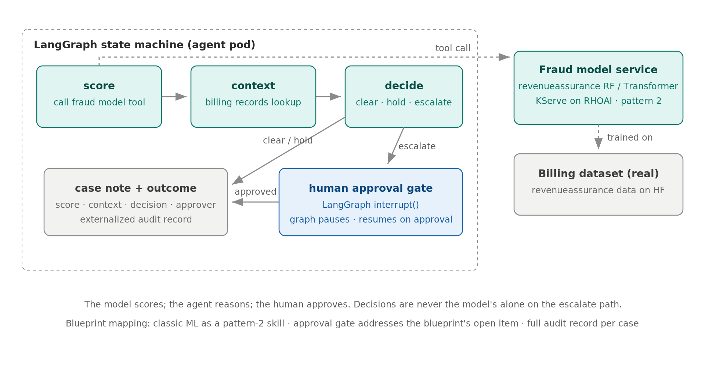
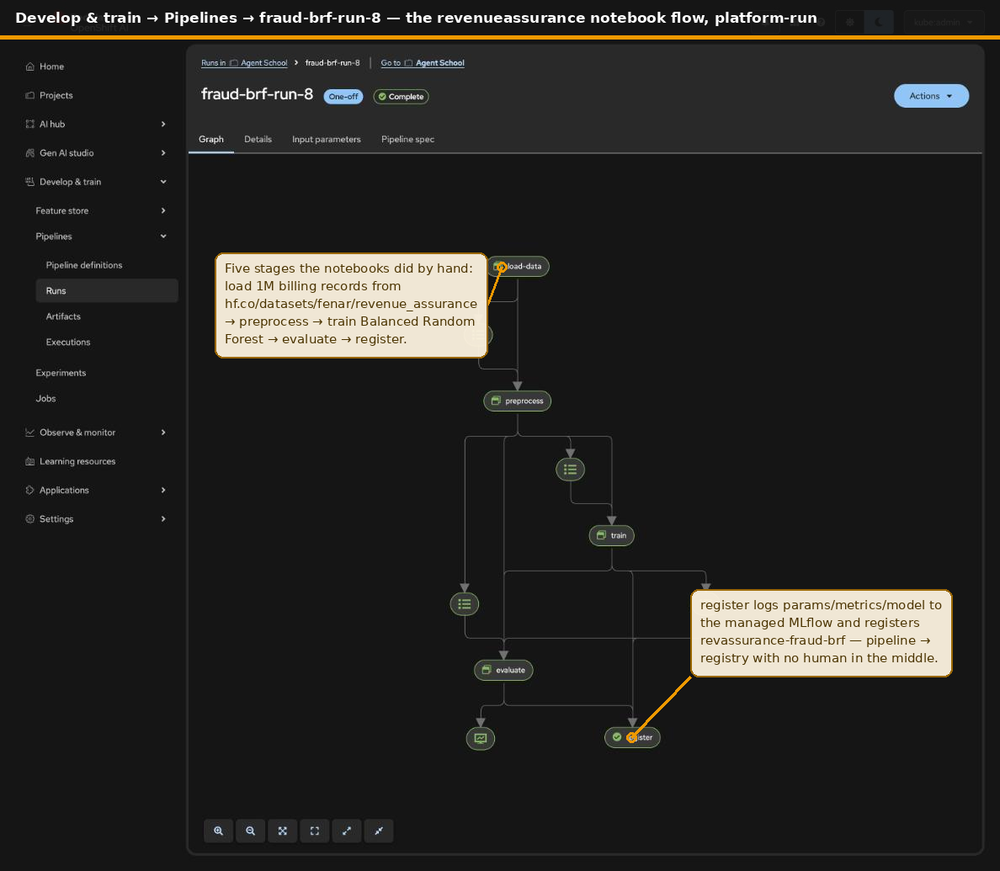
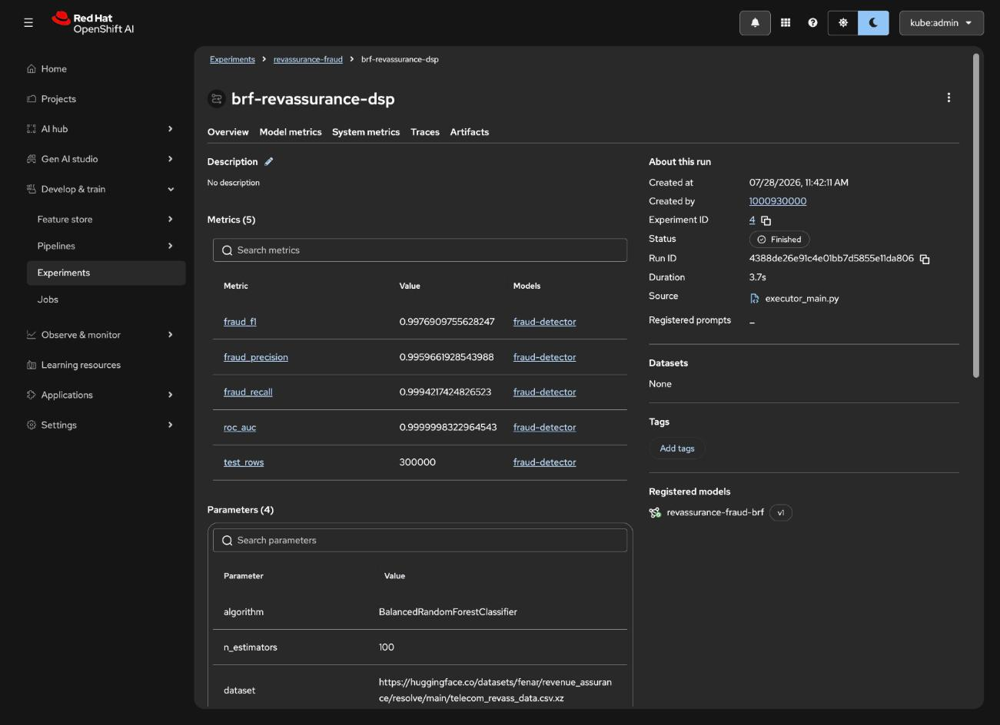

# 202 · Fraud Triage

> **Build status:** the model pipeline is live on Rome. `fraud-brf-training`
> runs green end-to-end on RHOAI Data Science Pipelines and registers
> `revassurance-fraud-brf` in the workspace MLflow (evidence below). The
> LangGraph agent that consumes it is the next stage.

A decision agent that consumes a trained fraud model as a tool, gathers
billing context, and routes each case to clear, hold, or escalate, with a
human-approval gate on the escalate path. The model scores; the agent
reasons; the human approves.

**Source experiment:** [revenueassurance](https://github.com/open-experiments/Telco-AIX/tree/main/revenueassurance)
(Balanced Random Forest and Transformer fraud models with the telecom
billing dataset published on Hugging Face).

**Harness:** LangGraph; its `interrupt()` is the cleanest way to teach the
human-approval pattern.

## Architecture

The zones separate what the pod is from what it uses. The agent pod
carries only the LangGraph state machine — score, context, decide, the
approval gate, the audit writer. Everything with weight lives in the
cluster: the fraud model served on KServe, the Feast billing features,
MLflow holding the training lineage and the per-case audit. The two
things that must stay outside the cluster stay outside: the published
dataset and the human approver — escalations leave the machine and come
back only with a person's decision.

This course is the agentification of the manual
[revenueassurance](https://github.com/open-experiments/Telco-AIX/tree/main/revenueassurance)
notebook flow: the data pipeline (billing dataset → Balanced Random
Forest training → registered version → KServe) is the same platform
pattern course 101 already proved live on Rome, applied to the
[fenar/datasets](https://huggingface.co/fenar/datasets) revenue-assurance
billing records.

## The model pipeline, live on Rome

What the notebooks did cell by cell now runs as a Data Science Pipeline
(`pipeline/`): load 1,000,000 billing records from
[fenar/revenue_assurance](https://huggingface.co/datasets/fenar/revenue_assurance)
(1.7% fraud) → preprocess → train the Balanced Random Forest → evaluate →
register. Live captures from Rome, not mockups:

The register stage lands the run in MLflow with full lineage — fraud-class
precision 0.996 / recall 0.999 / F1 0.998 / ROC-AUC ~1.0 on the
300,000-row held-out split — and registers `revassurance-fraud-brf` v1,
the version the agent's score node will consume from KServe:

Pipeline source, compiled IR, the in-cluster import Job, and the RHOAI
3.5 EA2 operational findings (kube-rbac-proxy access path, the task-level
MLflow plugin defect and its supported opt-out, workspace-scoped artifact
uploads) are documented in [pipeline/](./pipeline/) and
[deploy/ocp/rome](./deploy/ocp/rome).

## Solution flow

1. **score**: the graph's first node calls the fraud model as a tool. The
   revenueassurance model is served on KServe (pattern 2); the agent never
   embeds it.
2. **context**: for non-trivial scores, the agent pulls the customer's
   billing records to ground the decision.
3. **decide**: clear and hold cases complete autonomously with a case note.
4. **approval gate**: the escalate path hits `interrupt()`; the graph
   checkpoints, pauses, and resumes only when a human approves. This is the
   pattern our blueprint's Maturity section lists as an open product item,
   implemented at the harness level today.
5. Every outcome writes an externalized audit record: model score, context
   gathered, decision, and approver identity.

## Blueprint mapping

| Blueprint component | Here |
|---------------------|------|
| Harness | LangGraph state machine in the pod |
| Skill backend (pattern 2) | fraud model on KServe (RHOAI) |
| Data/model pipeline | RHOAI Data Science Pipelines: dataset → BRF → registered version (live) |
| Feature store | Feast billing features — training offline, case context online (planned) |
| Model lifecycle | MLflow Experiments → registered fraud-model versions → KServe |
| Human-in-the-loop | LangGraph interrupt + checkpoint |
| Ephemeral sessions | graph state checkpointed externally |
| Audit | case record per decision (+ graph-node traces in MLflow) |

## What it teaches

1. Classic ML as an agent tool: the score is an input to reasoning, never
   the decision itself on high-risk paths.
2. Human approval as a first-class graph state, not a bolt-on.
3. Audit records that make every decision reconstructable.
4. The pipeline as the model's factory: repeatable, per-stage observable,
   registering versions — not a notebook artifact someone once uploaded.

## Status

In progress — build stage 1 of 3 complete.

1. **Model pipeline (done, live on Rome):** `fraud-brf-training` on Data
   Science Pipelines, model registered as `revassurance-fraud-brf`.
2. **Serving:** promote the registered version to KServe (or a local
   FastAPI wrapper for laptop dev).
3. **Agent:** the LangGraph graph with the approval gate, consuming the
   served model; Feast billing features for online case context.

RHOAI snapshots are added as each stage goes live — this README carries
no mockups.
