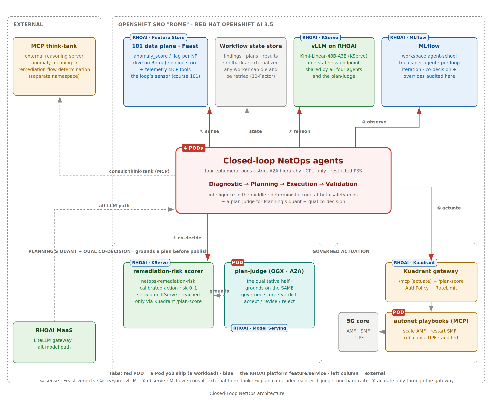
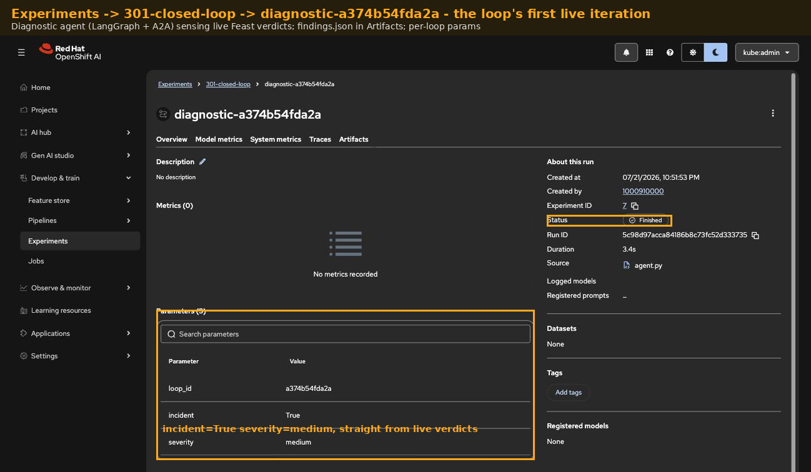
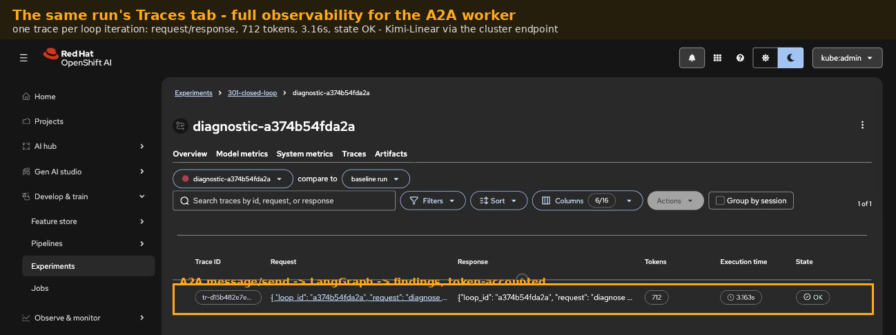
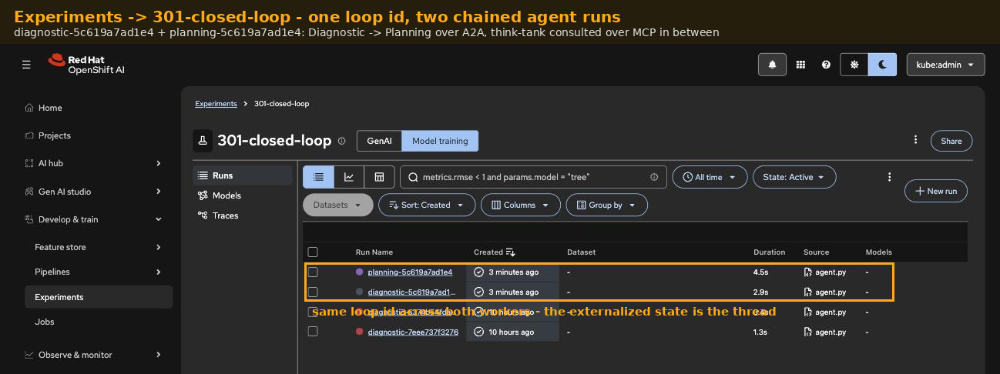
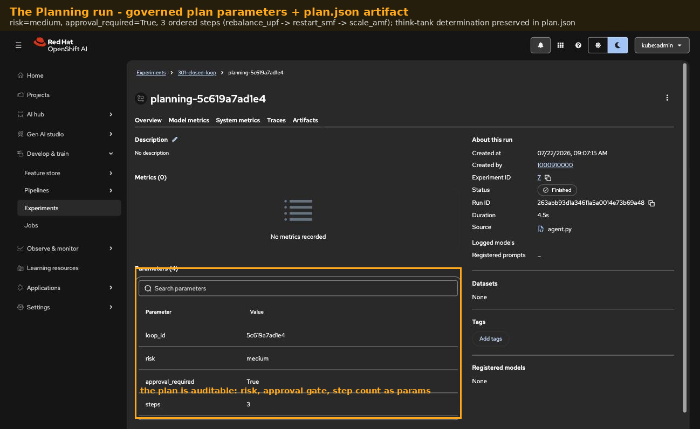

# 301 · Closed-Loop NetOps

The flagship: Diagnostic → Planning → Execution → Validation agents running
the autonomous remediation loop over A2A, with Ansible playbooks as the
governed remediation arm. This is the Telco-AIX autonet experiment rebuilt
on the open agentic architecture, the modernization our Agentic Telco AI
article describes.

**Source experiments:** [autonet](https://github.com/open-experiments/Telco-AIX/tree/main/autonet)
(four-agent 5G operations loop: AMF/SMF/UPF monitoring, per-NF vector
stores, remediation playbooks) and
[agentic](https://github.com/open-experiments/Telco-AIX/tree/main/agentic)
(the original framework). Their custom ACP/MCP protocols are replaced with
A2A and MCP-standard tooling.

**Harness:** LangGraph per agent, A2A between agents (teaching). A NemoClaw
track is planned: the same four agents deployed as a NemoClaw blueprint into
OpenShell sandboxes, which exercises the full control band of the article's
Figure-1.

## Architecture

The zones tell the loop's story. The four workers are ephemeral pods in a
strict hierarchy — everything they know lives in the external workflow
state store, everything they say crosses A2A. The cluster provides the
loop's sensor (course 101's Feast online store, already serving live
`anomaly_score`/`anomaly_flag` verdicts on Rome), one shared vLLM
endpoint, MLflow for full-cycle traces, and the governed actuation path:
Execution can only reach the 5G core through the MCP Gateway and the
audited autonet playbooks. The one deliberately external dependency is
the MCP think-tank — a reasoning server outside the cluster that turns a
detected anomaly into a remediation-flow determination, keeping
"what should we do" separable from "who is allowed to do it".

## Solution flow

1. **Diagnostic** consumes the anomaly verdicts 101's pipeline pushes to
   the Feast online store, plus the real autonet AMF/SMF/UPF telemetry
   and vector stores, detects the incident, and publishes findings over
   A2A.
2. **Planning** turns findings into a remediation plan with impact and
   resource estimates, consulting the external MCP think-tank for the
   remediation-flow determination (the anomaly's meaning, the candidate
   fix, its ordering).
3. **Execution** actuates the plan: the real autonet playbooks (scale AMF,
   restart SMF, rebalance UPF) run behind the MCP Gateway under scoped
   RBAC; an agent that can run playbooks is the most dangerous component
   in the system, so this is where governance concentrates.
4. **Validation** verifies KPIs against the live series, triggers rollback
   on failure, and closes the cycle.
5. Workflow state lives outside every agent. Each agent is an ephemeral
   one-pod worker; any stage can die and be retried by a fresh session
   (the 12-Factor Agent discipline: strict hierarchy, no peer chatter,
   externalized state).

## Stages 1-2, live on Rome

The state store, the A2A skeleton, and the Diagnostic worker are live —
captures from the cluster, not mockups.

The externalized workflow state store runs as a Redis 7 deployment
(`loop-state`); every loop iteration's record lands there under
`loop:<id>:*` keys, so any worker can die and be replaced mid-loop
([deploy/ocp/rome/state-store.yaml](./deploy/ocp/rome/state-store.yaml)).

The Diagnostic agent ([agents/diagnostic/](./agents/diagnostic/)) is a
LangGraph graph behind a real A2A surface — agent card at
`/.well-known/agent.json`, JSON-RPC `message/send` (a2a-sdk 0.3.22,
pinned: the 1.x line reshuffles the server API). Its three nodes:
**sense** pulls the live anomaly verdicts and 1h KPI means from 101's
Feast online store; **analyze** reasons over them with the cluster's
own Kimi-Linear endpoint; **publish** externalizes the findings. The
in-cluster A2A smoke client drove a real iteration end-to-end:
incident=true across amf/smf/upf with evidence citing the live scores,
and the state read back by a *different* pod (`status=diagnosed`) —
the 12-Factor proof that the answer and the state are separate things:

Every iteration is one MLflow run in experiment `301-closed-loop` with
the LangGraph trace attached — token-accounted observability for an
A2A worker, in the same Experiments tab as every other course:

EA2 findings along the way: `mlflow.langchain.autolog()` needs base
`langchain` installed (langchain-openai alone leaves tracing silently
dark), and artifact logging (`log_dict`) needs the requests-level
workspace-header shim — the same finding the 202 pipeline hit, now
confirmed from a second call path.

**Stage 2 — Planning and the external think-tank.** The MCP
think-tank runs in its own namespace (`think-tank`): no shared
ServiceAccounts, secrets, or state with the agents — they know only
its URL. That is the article's separation of "what should we do" from
"who is allowed to do it", modeled honestly on one cluster
(off-cluster in a real deployment; the MCP-over-streamable-HTTP wire
contract is identical either way). Its single tool,
`determine_remediation_flow`, reasons over the findings with the
cluster's Kimi endpoint and answers only in terms of the governed
autonet playbook catalog ([agents/thinktank/](./agents/thinktank/)).

The Planning agent ([agents/planning/](./agents/planning/)) reads the
diagnostic record from the state store, consults the think-tank over
MCP, and merges determination + findings into a governed plan — the
think-tank's raw determination is preserved in the plan record, so
the external black box stays auditable from the loop's side. The
chain smoke Job drove both stages on one loop id:

The resulting plan is the governance artifact the article asks for:
ordered steps restricted to the playbook catalog (on the live
incident: rebalance_upf → restart_smf → scale_amf), risk=medium,
**approval_required=true**, and a KPI rollback trigger — the human
gate and the abort condition decided before anything runs:

## Blueprint mapping

| Blueprint component | Here |
|---------------------|------|
| Harness | LangGraph per agent, one sandboxed pod each |
| Orchestration | A2A messaging + AgentCards |
| Sensing | 101's Feast online anomaly verdicts (live on Rome today) |
| External reasoning | MCP think-tank: anomaly meaning → remediation-flow determination |
| Tool governance | playbooks behind MCP Gateway, scoped RBAC |
| Externalized state | workflow store outside all agents |
| Observability | MLflow traces per agent, per loop iteration |
| Product-harness track | NemoClaw blueprint + OpenShell (planned) |

## What it teaches

1. Multi-agent coordination without east-west chatter: a strict
   Diagnostic → Planning → Execution → Validation hierarchy.
2. Ephemeral workers and externalized state as the scaling unlock.
3. Governed actuation: the loop can touch the network only through an
   authorized, audited gateway path, with rollback owned by Validation.

## Status

In progress — stages 1 and 2 of the build order are live on Rome:
the state store (`loop-state`), the A2A skeleton, the Diagnostic
agent (Feast verdicts → LangGraph → findings → externalized state →
MLflow), the external MCP think-tank in its own namespace, and the
Planning agent (state → MCP consult → governed plan with approval
gate and rollback trigger) — chained end-to-end on one loop id by an
in-cluster smoke client ([deploy/ocp/rome](./deploy/ocp/rome)). Next
per the build order: Execution against stand-in `fiveg-core` NFs
behind governed RBAC (real Ansible scale/restart), then Validation to
close the cycle. Reuses 101 telemetry tools, the autonet playbook
set, and the autonet per-NF vector stores. Snapshots land stage by
stage — no mockups.
