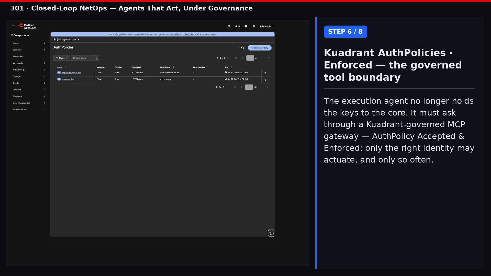
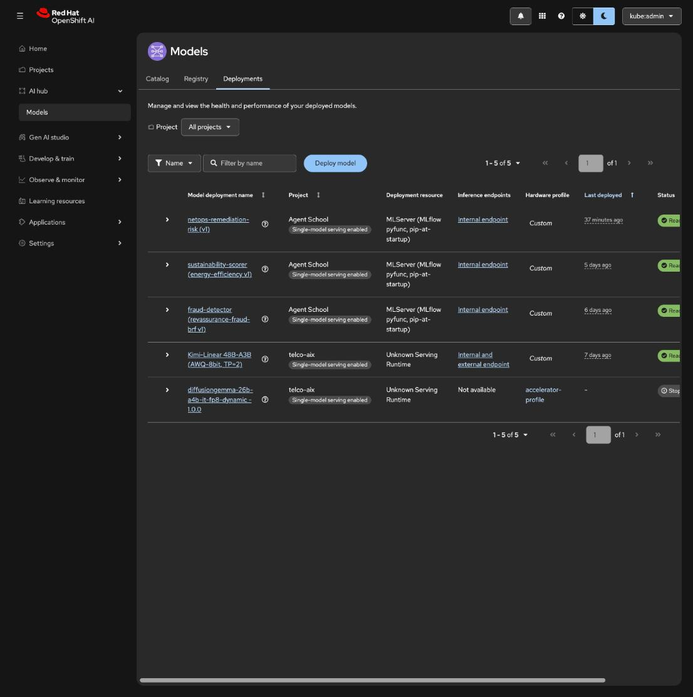
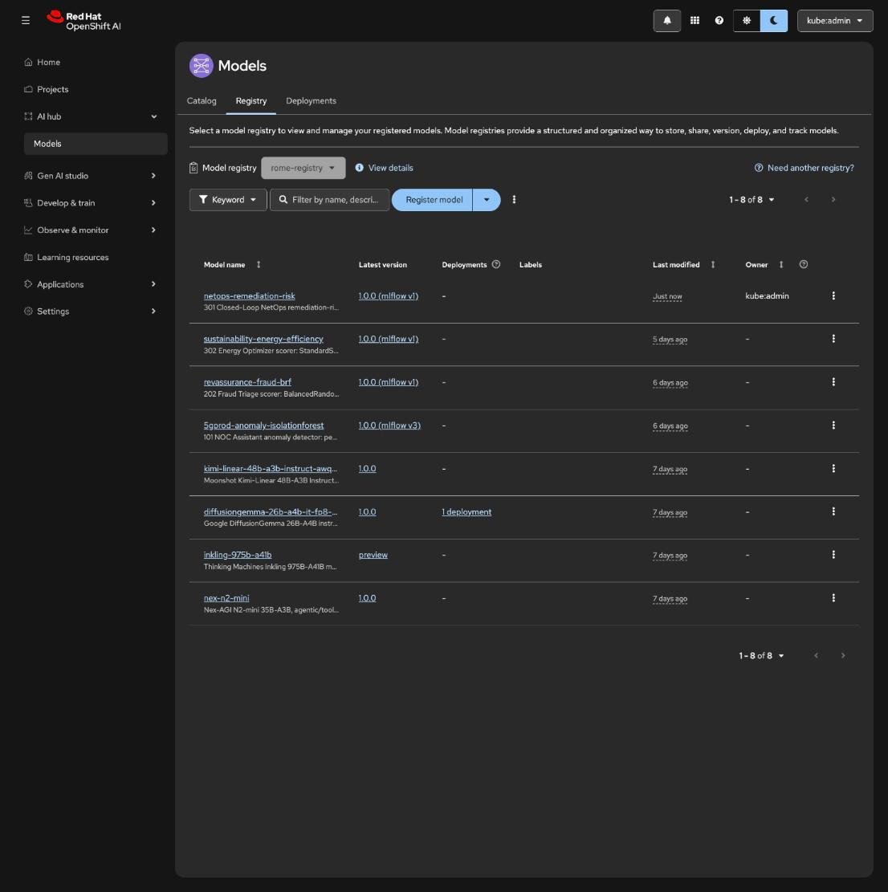
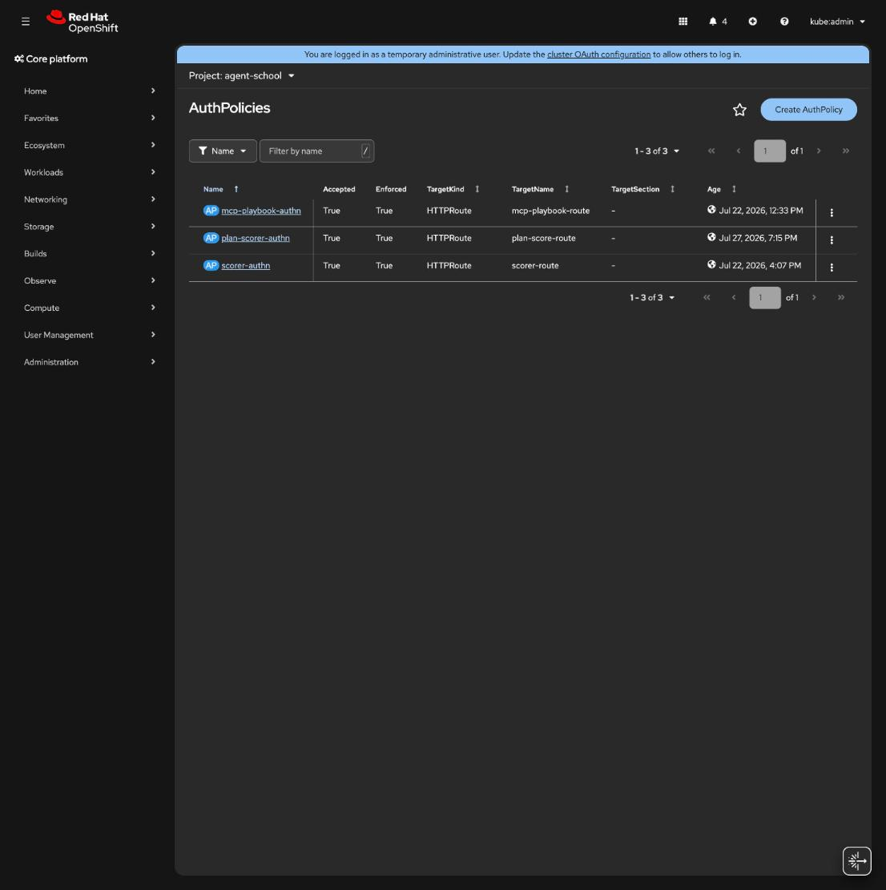
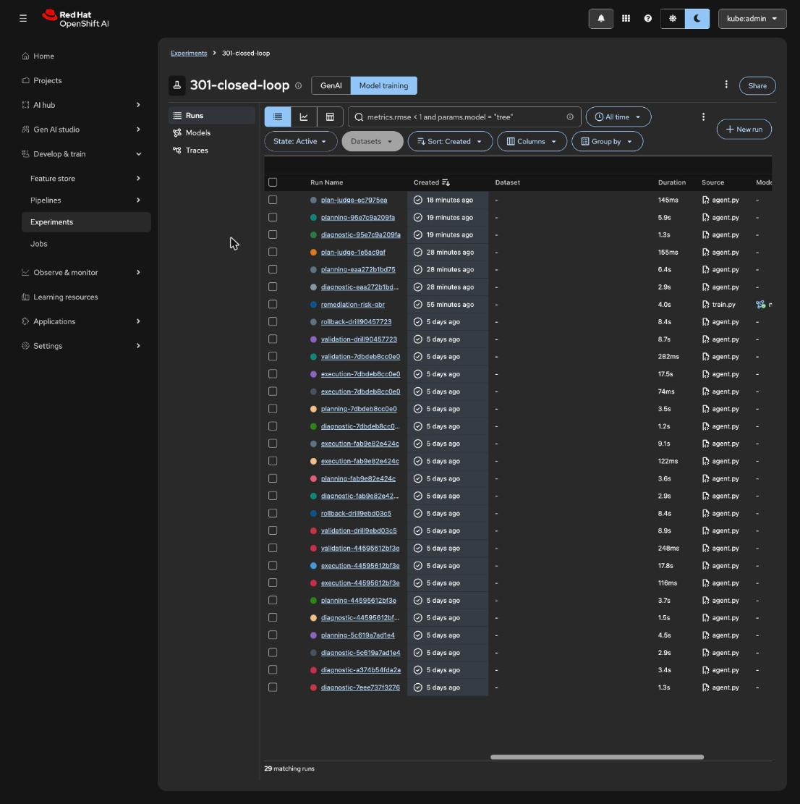
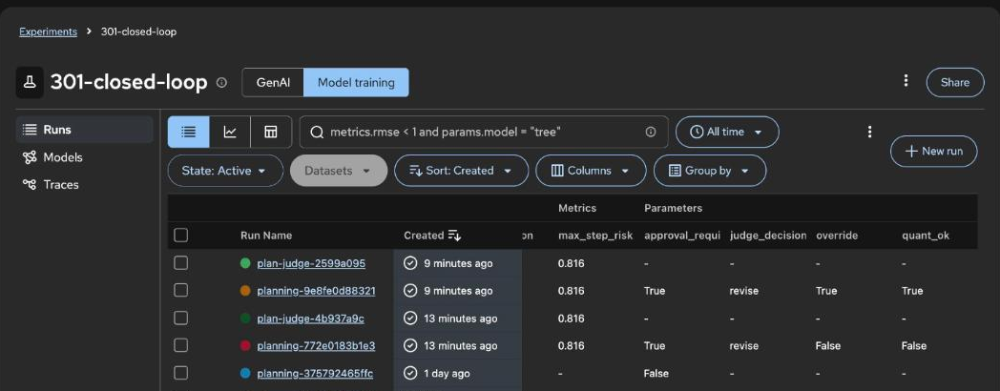
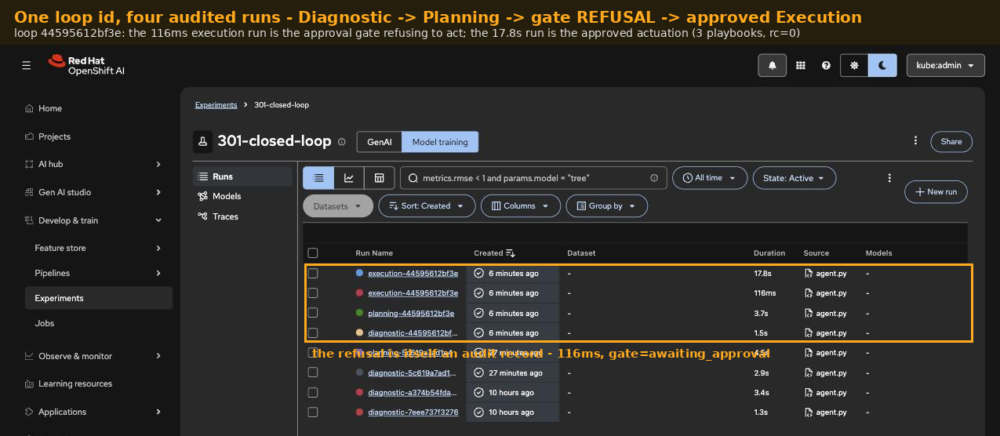
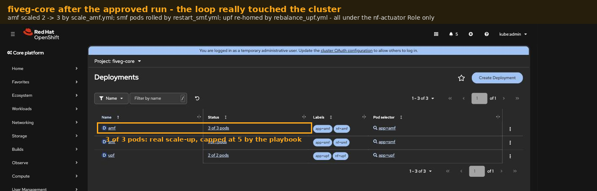
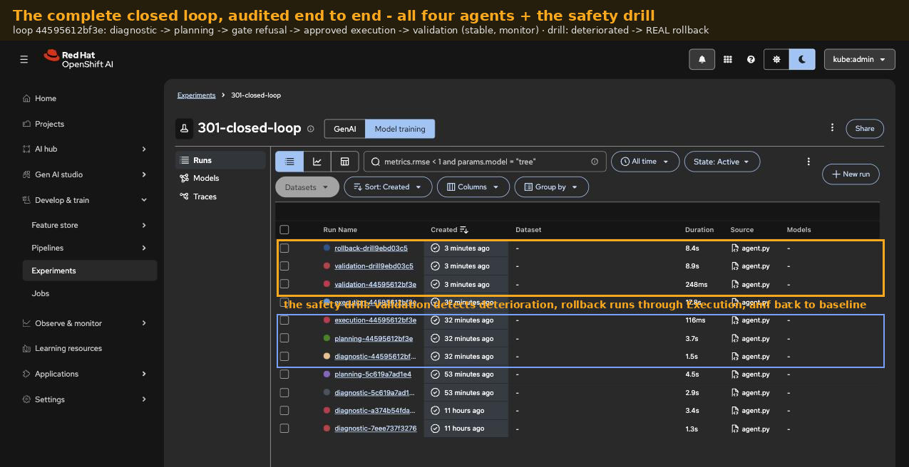

# 301 · Closed-Loop NetOps

The flagship: Diagnostic → Planning → Execution → Validation agents running
the autonomous remediation loop over A2A, with Ansible playbooks as the
governed remediation arm. This is the Telco-AIX autonet experiment rebuilt
on the open agentic architecture, the modernization our Agentic Telco AI
article describes.

**Source experiments:** [autonet](https://github.com/open-experiments/Telco-AIX/tree/main/autonet)
(four-agent 5G operations loop: AMF/SMF/UPF monitoring, per-NF vector
stores, remediation playbooks) and
[agentic](https://github.com/open-experiments/Telco-AIX/tree/main/agentic)
(the original framework). Their custom ACP/MCP protocols are replaced with
A2A and MCP-standard tooling.

**Harness:** LangGraph per agent, A2A between agents (teaching). A NemoClaw
track is planned: the same four agents deployed as a NemoClaw blueprint into
OpenShell sandboxes, which exercises the full control band of the article's
Figure-1.

## Walkthrough video

A narrated walkthrough (8:56) — the problem, then the step-by-step agentic
solution over the live RHOAI portal and OpenShift console on our reference
cluster called Venice, including the Kuadrant-governed actuation boundary.
Click the poster to play or download:

## Architecture

The zones tell the loop's story. The four workers are ephemeral pods in a
strict hierarchy — everything they know lives in the external workflow
state store, everything they say crosses A2A. The cluster provides the
loop's sensor (course 101's Feast online store, already serving live
`anomaly_score`/`anomaly_flag` verdicts on Rome), one shared vLLM
endpoint, MLflow for full-cycle traces, and the governed actuation path:
Execution can only reach the 5G core through the MCP Gateway and the
audited autonet playbooks. The one deliberately external dependency is
the MCP think-tank — a reasoning server outside the cluster that turns a
detected anomaly into a remediation-flow determination, keeping
"what should we do" separable from "who is allowed to do it".

## Solution flow

1. **Diagnostic** consumes the anomaly verdicts 101's pipeline pushes to
   the Feast online store, plus the real autonet AMF/SMF/UPF telemetry
   and vector stores, detects the incident, and publishes findings over
   A2A.
2. **Planning** turns findings into a remediation plan with impact and
   resource estimates, consulting the external MCP think-tank for the
   remediation-flow determination (the anomaly's meaning, the candidate
   fix, its ordering).
3. **Execution** actuates the plan: the real autonet playbooks (scale AMF,
   restart SMF, rebalance UPF) run behind the MCP Gateway under scoped
   RBAC; an agent that can run playbooks is the most dangerous component
   in the system, so this is where governance concentrates.
4. **Validation** verifies KPIs against the live series, triggers rollback
   on failure, and closes the cycle.
5. Workflow state lives outside every agent. Each agent is an ephemeral
   one-pod worker; any stage can die and be retried by a fresh session
   (the 12-Factor Agent discipline: strict hierarchy, no peer chatter,
   externalized state).

## The loop, live on Rome

The state store, the A2A skeleton, and the Diagnostic worker are live —
captures from the cluster, not mockups.

The externalized workflow state store runs as a Redis 7 deployment
(`loop-state`); every loop iteration's record lands there under
`loop:<id>:*` keys, so any worker can die and be replaced mid-loop
([deploy/ocp/rome/state-store.yaml](./deploy/ocp/rome/state-store.yaml)).

The Diagnostic agent ([agents/diagnostic/](./agents/diagnostic/)) is a
LangGraph graph behind a real A2A surface — agent card at
`/.well-known/agent.json`, JSON-RPC `message/send` (a2a-sdk 0.3.22,
pinned: the 1.x line reshuffles the server API). Its three nodes:
**sense** pulls the live anomaly verdicts and 1h KPI means from 101's
Feast online store; **analyze** reasons over them with the cluster's
own Kimi-Linear endpoint; **publish** externalizes the findings. The
in-cluster A2A smoke client drove a real iteration end-to-end:
incident=true across amf/smf/upf with evidence citing the live scores,
and the state read back by a *different* pod (`status=diagnosed`) —
the 12-Factor proof that the answer and the state are separate things:

Every iteration is one MLflow run in experiment `301-closed-loop` with
the LangGraph trace attached — token-accounted observability for an
A2A worker, in the same Experiments tab as every other course:

EA2 findings along the way: `mlflow.langchain.autolog()` needs base
`langchain` installed (langchain-openai alone leaves tracing silently
dark), and artifact logging (`log_dict`) needs the requests-level
workspace-header shim — the same finding the 202 pipeline hit, now
confirmed from a second call path.

**Stage 2 — Planning and the external think-tank.** The MCP
think-tank runs in its own namespace (`think-tank`): no shared
ServiceAccounts, secrets, or state with the agents — they know only
its URL. That is the article's separation of "what should we do" from
"who is allowed to do it", modeled honestly on one cluster
(off-cluster in a real deployment; the MCP-over-streamable-HTTP wire
contract is identical either way). Its single tool,
`determine_remediation_flow`, reasons over the findings with the
cluster's Kimi endpoint and answers only in terms of the governed
autonet playbook catalog ([agents/thinktank/](./agents/thinktank/)).

The Planning agent ([agents/planning/](./agents/planning/)) reads the
diagnostic record from the state store, consults the think-tank over
MCP, and merges determination + findings into a governed plan — the
think-tank's raw determination is preserved in the plan record, so
the external black box stays auditable from the loop's side. The
chain smoke Job drove both stages on one loop id:

The resulting plan is the governance artifact the article asks for:
ordered steps restricted to the playbook catalog (on the live
incident: rebalance_upf → restart_smf → scale_amf), risk=medium,
**approval_required=true**, and a KPI rollback trigger — the human
gate and the abort condition decided before anything runs:

**Stage 2b — the quant + qual co-decision.** Until now that plan's
`risk` and `approval_required` were the *language model's own*
self-assessment — qualitative reasoning with nothing calibrated
underneath it. This stage grounds the decision, mirroring 302's
arbiter on the actuation-planning side: the drafted plan is a
*candidate*, and before it is published two signals co-decide.

*Quant* is 301's own classic-ML track — `netops-remediation-risk`, a
calibrated regressor (`training/train_remediation_risk.py`,
GradientBoosting, r² ≈ 0.97) that scores how risky it is to actuate a
given playbook action on a given NF under the current incident state.
301 no longer only *borrows* 101's anomaly verdict; it has its own
model, trained on the real 5gprod per-minute KPIs, tracked in MLflow,
registered and promoted (`netops-remediation-risk`), and served on
KServe. Its target is a **documented computed proxy** —
`base_disruptiveness[action] × load × severity`, all real measured
quantities (a restart on a saturated, degraded SMF scores ~0.8; adding
an AMF replica on an idle one ~0.2) — an honest bootstrap that a live
core's real remediation outcomes replace, never an invented label
(lessons doc EA-14). Trained live on Rome (r² 0.9714, MAE 0.0235 over
8,646 rows), it serves next to its course siblings on the AI hub
Deployments tab and is promoted in the model registry as
`netops-remediation-risk` 1.0.0:

The plan agent reaches it **only** through the
Kuadrant gateway's `/plan-score` tool: Authorino authorizes exactly
`planning-agent` and `plan-judge-agent`, Limitador caps the rate — the
same East-West governance 301 puts on *actuation*, now on the
*decision*. On Rome the decision surface and the actuation surface sit
side by side, all Accepted and Enforced:

*Qual* is the GenAI **plan-judge** (`agents/judge/`, A2A, OGX
(Llama Stack) on the cluster Kimi). It receives the ordered plan, re-fetches each
step's calibrated risk itself through the same governed tool (grounded
by construction), and returns `accept | revise | reject` with
confidence, rationale, cited risks, and the context a scalar cannot see
— an ordering hazard (restart before rebalance drains sessions), a peak
or maintenance window, blast radius on an already-degraded neighbour.

A code arbiter combines them. The judge is a **full co-decider** — its
decision stands, and it can clear a plan the quant gate would have held
or hold one the quant gate would have cleared — with exactly one
non-negotiable rail: a step whose calibrated risk breaches
`HARD_RISK_FLOOR` (0.85) forces human approval no matter what either
signal says. The grounded verdict **overwrites** the LLM's `risk` and
`approval_required` (Execution still enforces the approval gate in
code, unchanged), and every judge-vs-quant disagreement is recorded as
an audited **override** in the plan record and MLflow. Judge
unreachable → the quant gate alone, honestly recorded. Intelligence
still lives in the middle of the loop; now it is calibrated and
governed, not just fluent.

**The co-decision, live on Rome.** Two full loop episodes drove the
codecide path end to end. Each episode's diagnostic → planning →
plan-judge stages land as runs in `301-closed-loop`, next to the
`remediation-risk-gbr` training run:

Open a planning run and the co-decision is platform data, not prose.
On the live incident the planner drafted a three-step plan including
`restart_smf`; the served model scored `max_step_risk` **0.813**
through the governed gateway; the quant gate held it
(`quant_ok=False` against the 0.66 ceiling); the judge independently
ruled `revise` at 0.75 confidence; consensus — `override=False`,
`hard_risk_rail=False`, `approval_required=True`:

An override drill then tightened `QUANT_RISK_CEILING` to 0.3 and
re-drove the loop: the changed threshold shows up in the second
episode's audit record, and the judge *still* declined to clear the
risky plan — a co-decider that refuses to rubber-stamp. The
override-in-both-directions and hard-rail paths remain verified by the
offline arbiter truth table; nothing about a live LLM's judgment is
staged to force an outcome.

**Stage 3 — Execution, the governed actuation arm.** Deliberately the
least clever component in the system: no LLM in this pod. Execution
([agents/execution/](./agents/execution/)) reads the governed plan
from the state store, enforces the approval gate **in code** (not in a
prompt — `approval_required=true` without an approve token is refused
and recorded as `awaiting_approval`), and actuates the steps by
running the real Ansible playbooks (`kubernetes.core`) in
[agents/execution/playbooks/](./agents/execution/playbooks/). Its
reach is exactly one Role: deployments and their scale in the
`fiveg-core` namespace
([deploy/ocp/rome/execution-rbac.yaml](./deploy/ocp/rome/execution-rbac.yaml)).
Rome has no live 5G core, so the target is stand-in AMF/SMF/UPF
Deployments ([fiveg-core.yaml](./deploy/ocp/rome/fiveg-core.yaml) —
documented honestly); the governance mechanics are fully real.

The full-loop smoke drove one iteration end to end — including the
negative test. Four audited runs on one loop id, and the refusal is
itself an audit record:

The approved run actuated all three plan steps (`rebalance_upf`,
`restart_smf`, `scale_amf`, each rc=0) and the cluster shows it: amf
scaled 2 → 3 by the playbook (governed cap 5), smf pods rolled, upf
re-homed — state advanced `planned → awaiting_approval → executed`
with the playbook outputs and a post-action NF snapshot externalized
for audit:

**Stage 4 — Validation closes the cycle.** Also deterministic — no
LLM. Validation ([agents/validation/](./agents/validation/)) re-reads
the live anomaly verdicts after actuation, compares them against the
pre-action baseline Diagnostic recorded, and decides with fixed
thresholds: `improved` closes the loop as resolved, `stable` closes
it as monitor, `deteriorated` triggers ROLLBACK — requested over A2A
*through Execution*, because the loop has exactly one actuation path
and Validation's ServiceAccount has no RBAC in `fiveg-core` at all.
Intelligence lives in the middle of the loop (Diagnostic, Planning);
both safety-critical ends are code.

The validation smoke proved both dispositions. The natural path
validated the executed loop: verdict `stable`, deltas 0.0 —
honest, because the published telemetry is a fixed dataset, so the
online verdicts cannot react to the stand-in NFs being scaled (on a
live core they would). And the rollback drill — a clearly-labeled
synthetic healthy baseline against the real post-action verdicts —
tripped `deteriorated` and drove a REAL rollback: the playbook ran
through Execution and amf returned to its baseline 2 replicas on the
actual cluster. Every step of both paths is an MLflow run:

## Blueprint mapping

| Blueprint component | Here |
|---------------------|------|
| Harness | LangGraph per agent, one sandboxed pod each |
| Orchestration | A2A messaging + AgentCards |
| Sensing | 101's Feast online anomaly verdicts (live on Rome today) |
| External reasoning | MCP think-tank: anomaly meaning → remediation-flow determination |
| Decision — quant | `netops-remediation-risk` regressor on KServe, reached only through the Kuadrant `/plan-score` tool |
| Decision — qual | GenAI plan-judge (A2A), grounded on the same governed scorer |
| Decision discipline | quant threshold + judge verdict + hard risk rail, in code; overrides audited in MLflow |
| Tool governance | playbooks behind MCP Gateway, scoped RBAC |
| Externalized state | workflow store outside all agents |
| Observability | MLflow traces per agent, per loop iteration |
| Product-harness track | NemoClaw blueprint + OpenShell (planned) |

## What it teaches

1. Multi-agent coordination without east-west chatter: a strict
   Diagnostic → Planning → Execution → Validation hierarchy.
2. Ephemeral workers and externalized state as the scaling unlock.
3. Governed actuation: the loop can touch the network only through an
   authorized, audited gateway path, with rollback owned by Validation.
4. **Quant + qual co-decision on the actuation side**: a calibrated
   risk model and a reasoning judge decide the plan together, grounded
   on the same governed number, with one hard rail no signal can
   override — and governance wraps the *decision*, not just the action.
   The calibrated model and the judge fail in opposite ways
   (calibrated-but-blind vs context-aware-but-uncalibrated), so pair
   them, ground the judge on the model's risk, and audit every
   disagreement.

## Status

**Complete — the full loop is live on Rome.** All four agents
(Diagnostic → Planning → Execution → Validation) run on the cluster
over A2A with externalized state (`loop-state`), the external MCP
think-tank in its own namespace, and exactly one governed actuation
path: Execution runs the real autonet Ansible playbooks against the
stand-in `fiveg-core` NFs under a single namespace-scoped Role, with
the approval gate enforced in code and proven by a negative test, and
Validation closes each cycle deterministically — including a rollback
drill that really returned amf to baseline through Execution. Every
stage of every episode is an MLflow run. Reuses 101 telemetry tools
and the autonet playbook set and vector stores. All captures are from
the cluster — no mockups.

**Stage 2b (quant + qual co-decision) — live on Rome, proven.** The
run-book in [deploy/ocp/rome](./deploy/ocp/rome) was executed end to
end on the cluster (July 2026): `netops-remediation-risk` trained
on-cluster (r² 0.9714, MAE 0.0235 over 8,646 rows, honesty probes
correct), registered in workspace MLflow, staged to MinIO, served on
KServe (Ready), promoted in the model registry, and wrapped as the
governed `/plan-score` tool with its AuthPolicy and RateLimitPolicy
Accepted + Enforced beside the actuation policies. The plan-judge is
deployed and Planning runs the codecide node. Two live loop episodes
produced audited co-decisions — the served model scored the drafted
plan at 0.813 through the gateway, the quant gate held, the judge
independently ruled revise, consensus recorded as platform data — and
an override drill proved the thresholds are live and audited (the
tightened ceiling appears in the episode record). The
override-in-both-directions and hard-rail paths are verified by the
offline arbiter truth table; the captures above are from the cluster,
not mockups.
