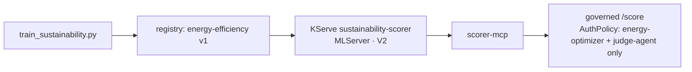
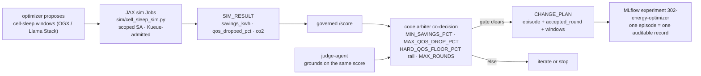

# Course 302 Execution Manual: Energy Optimizer

A step-by-step guide for the sustainability course: a Llama-Stack-harnessed optimizer agent proposes cell-sleep windows, simulates them as Kubernetes Jobs it submits itself, clears every accepted plan through a served energy-efficiency scorer behind a governed gateway route, and gets graded by a GenAI evaluation with an LLM judge.

Every step has three parts: **Why** explains what the step is for and what it means in the architecture, **Do** gives the exact action, and **Expect** gives the success signal.

The course reuses 301's llama-stack, gateway, and serving patterns. Run 301 (or at least its Step 3) first.

## Just look at it (no deployment needed)

| What | Where |
|---|---|
| The scorer model, served | RHOAI dashboard (`rome` or `venice`), AI hub, Models, Deployments, `sustainability-scorer` (project `agent-school`) |
| Registry entry | AI hub, Models, Registry, `sustainability-energy-efficiency` |
| Optimizer episodes (change plans, rounds, sim runs) | Experiments, `302-energy-optimizer` |
| GenAI eval scores | Same experiment, runs `genai-eval-*` (metrics: decision_correctness, groundedness, qos_safety, llm_groundedness) |
| Governance | Project `agent-school`, AuthPolicy `scorer-authn` on HTTPRoute `scorer-route` (path `/score`) |

## What you will build

A LinearRegression scorer (energy efficiency as a function of 11 network KPIs, r2 ~0.88 on the published 100K-row Telco-AIX dataset) trained in-cluster, staged to MinIO, served by MLServer on KServe. An optimizer agent that plans cell-sleep windows, spawns simulation Jobs under a purpose-scoped ServiceAccount (create Jobs, read logs, nothing else), iterates until the plan clears the savings/QoS gates, and records the accepted CHANGE_PLAN. A GenAI eval that replays episodes and scores them, numerically and with the cluster's own LLM as judge.

The big idea of 302 is **simulate before you act, and grade after you decide**: the agent's freedom is bounded by explicit numeric gates, its experiments run as disposable platform workloads, and its judgment is itself judged.

## Inner mechanics — the three loops

302 closes the series with the hardest question: not "did the agent act safely" but "did it **decide well**." Three loops: a **governed scorer**, a **simulate-before-act episode**, and a **GenAI evaluation** that measures the judge itself.

### Loop 1 · The scorer — quantitative truth behind a governed route

A calibrated model scores the energy/QoS trade-off precisely but is blind to context; a reasoning agent sees context but hallucinates numbers. So the quantitative signal gets the same treatment as 301's risk model: [`training/train_sustainability.py`](./training/train_sustainability.py) trains the sustainability regressor, the registry versions it, KServe serves it (`sustainability-scorer`, MLServer, V2), and [`scorer-mcp`](./agent/scorer-mcp/server.py) wraps it as an MCP tool behind the governed `/score` route — Kuadrant AuthPolicy admits exactly two identities (`energy-optimizer`, `judge-agent`). Every efficiency score in every episode passes a policy enforcement point with an identity attached; the agent never talks to the predictor directly.



### Loop 2 · The episode — propose, simulate, score, co-decide

The optimizer ([`agent/energy_optimizer.py`](./agent/energy_optimizer.py), driven through OGX / Llama Stack, [`agent/run.yaml`](./agent/run.yaml)) proposes RAN cell-sleep windows — then **simulates before acting**: it submits its own JAX simulation Jobs ([`sim/cell_sleep_sim.py`](./sim/cell_sleep_sim.py)) under the narrowly-scoped `energy-optimizer` ServiceAccount (create/watch Jobs and read pod logs in this one namespace, nothing else — delegation, not abdication), reads their logs, scores the outcome through the governed `/score`, and iterates. The gates are explicit env-config numbers, not prompt language: `MIN_SAVINGS_PCT` (the plan must be worth it), `MAX_QOS_DROP_PCT` (it must not hurt users), `HARD_QOS_FLOOR_PCT` (the rail nothing overrides), `MAX_ROUNDS` (bounded iteration, bounded spend). The judge grounds its qualitative verdict on the **same scorer number**, a code arbiter co-decides, and a `CHANGE_PLAN` is emitted only when the gate clears — the whole episode is one auditable MLflow record in `302-energy-optimizer`.



### Loop 3 · Measure the judge — agents grading agents

The optimizer's own gates say a plan passed; the eval asks whether the agent **decided well**. [`eval/genai_eval.py`](./eval/genai_eval.py) replays recent episodes and scores them on independent axes: decision correctness (did accept/reject match what the sim numbers justified), numeric groundedness (are claimed figures actually in the sim outputs), QoS safety, and an LLM-judged groundedness pass using the cluster's own model. The scores land as an eval run **next to the episodes they grade** (reference from the Venice run: decision_correctness 0.75, groundedness 0.875, qos_safety 0.875). The suite caught real defects on its first run — which is the series' closing statement: judges are workloads too, and they get measured. ROI: kWh and CO₂ saved with QoS protected by a rail, not a promise.

### Stage-to-code map

| Stage | Component | Where |
|---|---|---|
| Scorer training | sustainability regressor | [`training/train_sustainability.py`](./training/train_sustainability.py) |
| Scorer serving | KServe + governed /score | [`deploy/ocp/rome/serving.yaml`](./deploy/ocp/rome/serving.yaml), [`agent/scorer-mcp/server.py`](./agent/scorer-mcp/server.py), [`deploy/ocp/rome/scorer-gateway-policies.yaml`](./deploy/ocp/rome/scorer-gateway-policies.yaml) |
| Optimizer | OGX / Llama Stack episode loop | [`agent/energy_optimizer.py`](./agent/energy_optimizer.py), [`agent/run.yaml`](./agent/run.yaml) |
| Simulation | JAX cell-sleep sim, scoped SA, Kueue | [`sim/cell_sleep_sim.py`](./sim/cell_sleep_sim.py), [`deploy/ocp/rome/sim-rbac.yaml`](./deploy/ocp/rome/sim-rbac.yaml), [`job-sim-template.yaml`](./deploy/ocp/rome/job-sim-template.yaml) |
| Co-decision | code arbiter + judge, env-config gates | `MIN_SAVINGS_PCT` · `MAX_QOS_DROP_PCT` · `HARD_QOS_FLOOR_PCT` · `MAX_ROUNDS`, [`agent/judge/agent.py`](./agent/judge/agent.py) |
| Episode audit | one episode = one record | MLflow experiment `302-energy-optimizer` |
| Judge measured | GenAI evaluation suite | [`eval/genai_eval.py`](./eval/genai_eval.py), [`deploy/ocp/rome/job-genai-eval.yaml`](./deploy/ocp/rome/job-genai-eval.yaml) |

## Prerequisites (verify before you start)

1. Project `agent-school` with `llm-credentials`, `mlflow-tracking`, the SA-group MLflow binding, `dspa-minio-creds`, the `fraud-serving` SA and `aws-connection-minio-models` data connection (202 Step 6; the serving stack reuses them).
2. From 301 Step 3: `llama-stack` Deployment Ready (with its `llama-stack-config` ConfigMap from `302-energy-optimizer/agent/run.yaml`) and Gateway `netops-gateway` present.
3. Kimi-Linear Ready in `telco-aix`; managed MLflow running; MinIO `models` bucket.

## Step 1: Source ConfigMaps and the sim RBAC

**Why:** same pip-at-startup, source-in-ConfigMap pattern as 301: what runs is the text you can read, no custom images. The interesting object is the **sim RBAC**. The optimizer will submit its own simulation Jobs, which means an agent creating workloads on the cluster, and that capability gets the narrowest possible identity: the `energy-optimizer` SA can create and watch Jobs and read pod logs in this one namespace, and nothing else. Compare it mentally with giving an agent a kubeconfig; this is the difference between delegation and abdication.

**Do:** from a repo checkout, inside `302-energy-optimizer/`:

```
oc create configmap sustain-train-src -n agent-school --from-file=train.py=training/train_sustainability.py
oc create configmap sustain-stage-src -n agent-school --from-file=stage_model.py=serving/stage_model.py
oc create configmap sim-src           -n agent-school --from-file=cell_sleep_sim.py=sim/cell_sleep_sim.py
oc create configmap optimizer-src     -n agent-school --from-file=energy_optimizer.py=agent/energy_optimizer.py
oc create configmap genai-eval-src    -n agent-school --from-file=genai_eval.py=eval/genai_eval.py
oc create configmap judge-agent-src   -n agent-school --from-file=agent.py=agent/judge/agent.py
oc create configmap scorer-mcp-src    -n agent-school --from-file=server.py=agent/scorer-mcp/server.py
```

**Console:** Import YAML, paste `302-energy-optimizer/deploy/ocp/rome/sim-rbac.yaml`.

**Expect:** seven ConfigMaps plus ServiceAccount `energy-optimizer` with its Role and RoleBinding.

## Step 2: Train and stage the scorer

**Why:** the scorer is the course's ground truth for "did this plan help": energy efficiency as a learned function of 11 network KPIs from the published 100K-row dataset (efficiency defined as 100 minus predicted fault rate, following the source notebook). A deliberately simple model (StandardScaler + LinearRegression, r2 ~0.878) makes a teaching point: the value is not model sophistication, it is that the number the agent optimizes against is versioned, registered, and served instead of hard-coded in the prompt. Train registers it in MLflow; stage bridges it to `s3://models/...` for KServe, the same registry-to-object-store pattern as 202 and 301.

**Do (Console):** Import YAML, paste the two Jobs from `job-train-scorer.yaml` one at a time: first `train-sustainability`, and after it completes, `stage-sustainability`.

**Expect:** the train log reports r2 ~0.878 and registers `sustainability-energy-efficiency` v1; the stage log confirms the upload. Record it in AI hub, Models, Registry as on Rome/Venice.

## Step 3: Serve the scorer and govern the route

**Why:** the served scorer becomes a governed tool, exactly like 301's risk scorer: `sustainability-scorer` serves the model over the V2 protocol, `scorer-mcp` wraps it as an MCP tool, and the gateway policies publish it at `/score` with authentication by ServiceAccount token and authorization for exactly `energy-optimizer` and `judge-agent`. The agent never talks to the predictor directly; every efficiency score in every episode passed a policy enforcement point with an identity attached. Governance of tools, not trust in agents, is the series' through-line, and here you build it a second time in twenty minutes, which is the proof it is a pattern.

**Do (Console):** Import YAML, paste `serving.yaml`, then `scorer-mcp.yaml`, then `scorer-gateway-policies.yaml`.

**Expect:** InferenceService `sustainability-scorer` **Ready** (pip-at-startup, ~2 minutes); `scorer-mcp` Ready; AuthPolicy `scorer-authn` Accepted and Enforced. All the 202 MLServer findings apply (`MLSERVER_PARALLEL_WORKERS=0`, headless predictor Service so call `:8080`).

## Step 4: The judge agent

**Why:** the judge is the qualitative check on the optimizer's plans, and it runs through Llama Stack rather than raw chat completions: the harness gives it a structured Responses-style interface over the same in-cluster Kimi model. Architecturally it is one more A2A agent (agent card at `/.well-known/agent.json`, own SA, own Deployment) that consumes the same governed `/score` route as the optimizer, so both the doer and the checker measure with the same governed instrument. `enableServiceLinks: false` matters here for the same port-injection reason as llama-stack itself.

**Do (Console):** Import YAML, paste `judge.yaml`.

**Expect:** Deployment `judge-agent` Ready.

## Step 5: Run an optimization episode

**Why:** this is the course's autonomy loop in action, and every part of it is bounded. The agent proposes cell-sleep windows, then **simulates before acting**: it submits `cell-sleep-sim-*` Jobs under its scoped SA (watch them appear; an agent is creating workloads, using exactly the permission you granted in Step 1), reads their logs, scores the outcome through `/score`, and iterates. The gates are explicit env-config numbers, not prompt language: `MIN_SAVINGS_PCT=3.0` (the plan must be worth it), `MAX_QOS_DROP_PCT=0.5` (the plan must not hurt users), `HARD_QOS_FLOOR_PCT=2.0` (the rail nothing overrides), `MAX_ROUNDS=3` (bounded iteration, bounded spend). The accepted CHANGE_PLAN with its round number and windows is the episode's auditable output, and the whole episode is one MLflow record.

**Do (Console):** Import YAML, paste `job-optimize.yaml`.

**Expect:** the episode takes 5 to 10 minutes and its log ends with `CHANGE_PLAN {"episode": ..., "accepted_round": N, "windows": [...]}`; the episode is in Experiments `302-energy-optimizer`. On the reference runs the plan was accepted in round 1.

To mirror 301's negative-then-positive discipline, re-run once with a tightened gate (for example `MIN_SAVINGS_PCT=15`) and watch the episode end unaccepted, audited, before restoring the defaults. A gate you have only ever seen open is not a gate.

## Step 6: GenAI evaluation

**Why:** the optimizer's own gates say a plan passed; the eval asks the harder question of whether the agent **decided well**. It replays recent episodes and scores them on independent axes: decision correctness (did accept/reject match what the sim numbers justified), numeric groundedness (are the claimed figures actually in the sim outputs), QoS safety, and an LLM-judged groundedness pass using the cluster's own model. The scores land as an eval run in the same experiment, next to the episodes they grade. Agents that grade agents, with the grades stored as platform data, is the series' closing statement, and the numbers below from the reference run give you a baseline to compare against.

**Do (Console):** Import YAML, paste `job-genai-eval.yaml`.

**Expect:** log ends with `EVAL_METRICS {...}` and `GENAI_EVAL_OK`. Reference metrics from the Venice run: `{"decision_correctness": 0.75, "groundedness_numeric": 0.875, "qos_safety": 0.875, "llm_groundedness": 1, "llm_scored": 8}`. Inspect per-episode scores in the Experiments UI.

## Troubleshooting

- Optimizer cannot create sim Jobs: `sim-rbac.yaml` missing or the Job's `serviceAccountName` changed.
- Judge/optimizer 401 at `/score`: expected for other identities; for these two, check the AuthPolicy pattern matches their SA names exactly.
- llama-stack crash with a port parse error: `enableServiceLinks: false` was dropped from the Deployment.
- Eval judge timeouts: the LLM judge calls Kimi through the in-cluster endpoint; confirm the 101-era `llm-credentials` URL still resolves and the model pod is Ready.

## Cleanup

Delete the episode and eval Jobs (TTL cleans them anyway). The served scorer, judge, and policies are the course deliverable; the whole project can be deleted when the program is done.
