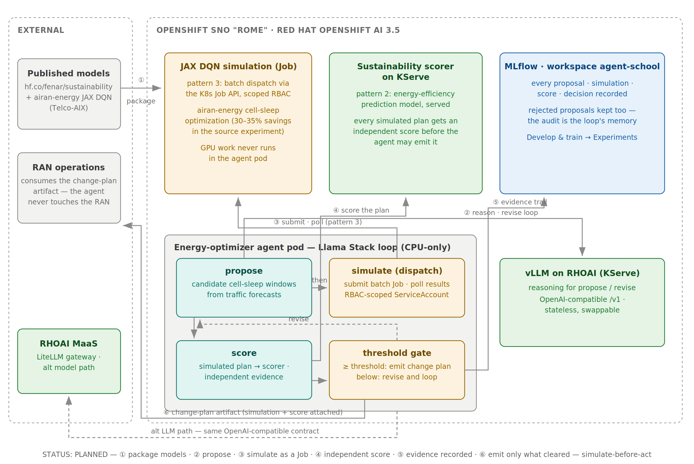
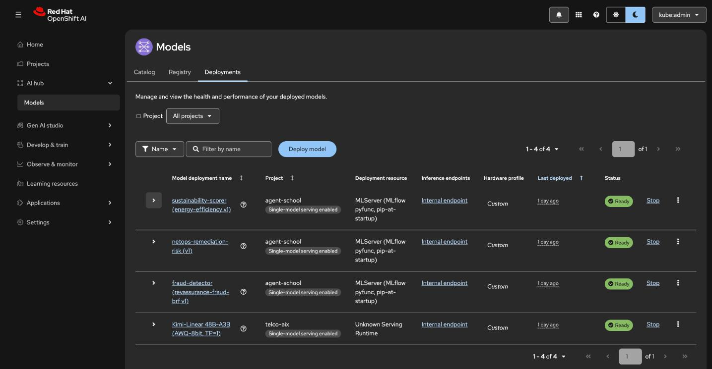
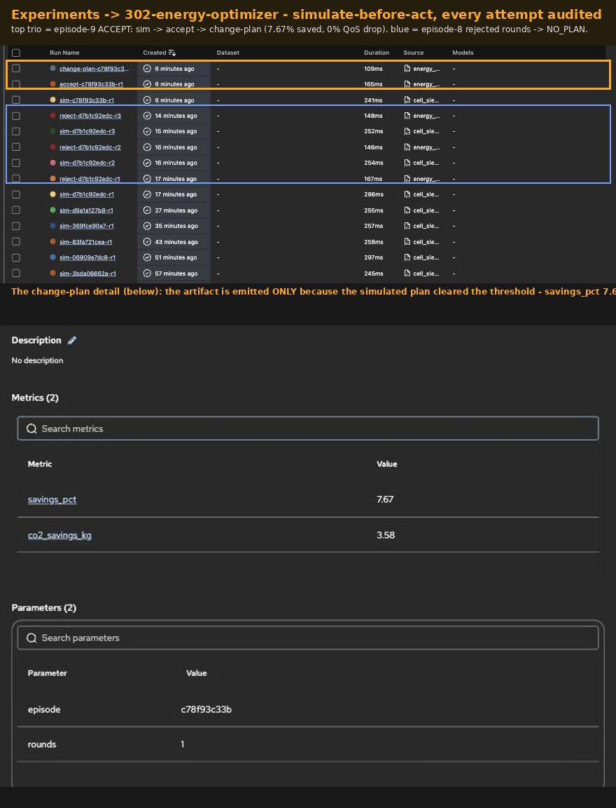

# 302 · Energy Optimizer

An agent that proposes RAN cell-sleep windows, simulates them before acting,
and emits a change plan only when the simulated outcome clears an
efficiency threshold. Simulate-before-act as a first-class pattern.

**Source experiments:** [airan-energy](https://github.com/open-experiments/Telco-AIX/tree/main/airan-energy)
(JAX-based DQN cell-sleep optimization, reporting 30-35% RAN energy savings)
and [sustainability](https://github.com/open-experiments/Telco-AIX/tree/main/sustainability)
(energy-efficiency prediction model published at
[fenar/sustainability](https://huggingface.co/fenar/sustainability)).

**Harness:** Llama Stack.

## Architecture

The zones make the safety argument visible. The agent pod holds only the
Llama Stack loop — propose, dispatch, score, threshold gate. The two
heavy skills live in the cluster under different patterns: the JAX DQN
simulation as a batch Job the agent may only submit and poll (pattern 3,
the RBAC lesson), and the sustainability scorer served on KServe
(pattern 2). Everything the loop produces — proposals, simulations,
scores, rejections — lands in MLflow. And the RAN itself is firmly in the
external zone: the agent's only output is a change-plan artifact with the
simulation and score attached; it never touches the network.

## Solution flow

1. The agent reasons over traffic forecasts and proposes candidate
   cell-sleep windows.
2. It submits the airan-energy JAX simulation as a batch Job (pattern 3:
   K8s Job API, scoped RBAC) and polls for results; the GPU work never runs
   in the agent pod.
3. The simulated plan is scored by the sustainability model served on
   KServe (pattern 2).
4. Score at or above threshold: the agent emits the change plan artifact
   with the simulation evidence attached. Below threshold: it revises the
   proposal and loops.

## The skill backends, live on Rome

Build stage 1 is live — both heavy skills exist for real before any
agent code, because simulate-before-act starts with having something
real to simulate against and score with.

**Pattern 2 — the sustainability scorer on KServe.** Trained
in-cluster ([training/train_sustainability.py](./training/train_sustainability.py))
as a faithful reproduction of the source notebook's recipe:
StandardScaler + LinearRegression over 11 network KPIs from the
experiment's published 100K-row 5G netops dataset, energy efficiency
= 100 − predicted fault rate (the source's own definition). r² 0.878
on the 20% holdout. Registered as `sustainability-energy-efficiency`
in MLflow and promoted to `rome-registry`, staged to MinIO, served by
the same MLServer-on-stock-UBI9 pattern 202 proved out — live V2
scoring verified against real dataset rows (served fault-rate
predictions track ground truth):

**Pattern 3 — the cell-sleep simulation as a queued Job.** The
simulation ([sim/cell_sleep_sim.py](./sim/cell_sleep_sim.py)) vendors
the airan-energy experiment's power and cost model (1000/700/500 W
active by load, 100 W light sleep, 200 W × 2 min wake transitions,
$0.12/kWh, 0.5 kg CO₂/kWh) with its diurnal traffic shape, vectorized
in JAX for a 24h sweep at 15-minute steps. QoS is physics, not
prompting: sleeping cells' traffic re-homes to awake neighbors' spare
capacity and the unservable remainder is reported as dropped. Each
proposal is one Kueue-admitted Job (queue label → shared ClusterQueue
→ Workload metrics), and the agent's ServiceAccount can do exactly
one thing: submit and poll these Jobs
([deploy/ocp/rome/sim-rbac.yaml](./deploy/ocp/rome/sim-rbac.yaml) —
the pattern-3 RBAC lesson). First live run through the queue:
night windows on 2 of 6 cells → 4.27% energy saved, 0.0% QoS drop,
logged to MLflow experiment `302-energy-optimizer` as `sim-manual`.

## The agent loop, live on Rome

Build stage 2 is live: the Llama Stack loop runs the full
simulate-before-act cycle on the cluster.

The harness is a **Llama Stack** server
([agent/run.yaml](./agent/run.yaml),
[deploy/ocp/rome/llama-stack.yaml](./deploy/ocp/rome/llama-stack.yaml))
with the `remote::vllm` inference provider pointing at the cluster's
own Kimi endpoint. (EA2 honesty: the DataScienceCluster runs
`llamastackoperator` Removed, so the stack runs as a plain Deployment
rather than a `LlamaStackDistribution` CR — swap when it graduates.)

The optimizer episode ([agent/energy_optimizer.py](./agent/energy_optimizer.py))
runs the loop: the agent **proposes** cell-sleep windows through the
Llama Stack Agents API (session memory carries rejections into revision
turns); each proposal is **dispatched** as a Kueue-admitted simulation
Job under the submit/poll-only Role (pattern 3 — the compute never runs
in the agent pod); the simulated network condition is **scored** on the
served sustainability model (pattern 2, KServe V2); and a **threshold
gate in code** (not the prompt) accepts only if savings and QoS and
efficiency all clear their bars. The agent's only output is a
change-plan artifact — it never touches the RAN.

Every attempt is an MLflow run, and the discipline shows in the record:
one episode's proposals were all **rejected** (they slept too many
cells, collapsing QoS) and closed `NO_PLAN` with no plan emitted; the
next episode's proposal **cleared the gate** (3 cells asleep 00:00–06:00
→ 7.67% energy saved, **0% QoS drop**, efficiency 68.3) and the
change-plan artifact was written — emitted *only* because the simulated
outcome passed:

EA2 findings from getting the loop live: the `llama-stack` Service's
injected `LLAMA_STACK_PORT` env collides with the server's own config
(`enableServiceLinks: false` is the fix); the client needs
`fire`/`termcolor`; and reading a completed sim Job's result off pod
stdout was unreliable (huge jax-install logs), so the loop reads the
sim's result back from its MLflow run — a deterministic channel.

## Blueprint mapping

| Blueprint component | Here |
|---------------------|------|
| Harness | Llama Stack loop in the pod |
| Skill backend (pattern 3) | JAX DQN simulation as batch Job |
| Skill backend (pattern 2) | sustainability scorer on KServe |
| Decision discipline | no plan without simulation + score attached |
| Audit | proposal, simulation, score, decision all recorded in MLflow — rejected proposals included |

## What it teaches

1. Pattern 3 in practice: job dispatch, polling, and the RBAC scrutiny it
   demands.
2. Simulate-before-act: the agent's own loop enforces evidence.
3. KPI-bound self-rejection: the threshold lives in the loop, not in the
   prompt.

## Status

Complete — both stages live on Rome.

1. **Skill backends (done):** the sustainability scorer trained from
   the published dataset, registered, promoted to `rome-registry`, and
   serving on KServe (pattern 2, live V2 call verified); the JAX
   cell-sleep simulation running as Kueue-admitted Jobs under
   submit/poll-only RBAC (pattern 3, verified through the queue).
2. **Agent (done):** the Llama Stack loop — propose (Agents API →
   Kimi), dispatch the sim Job, score on the served model, threshold
   gate in code, emit the change-plan artifact; both accept and
   reject/NO_PLAN paths proven live, every attempt in MLflow.

All RHOAI snapshots are live captures — no mockups.
