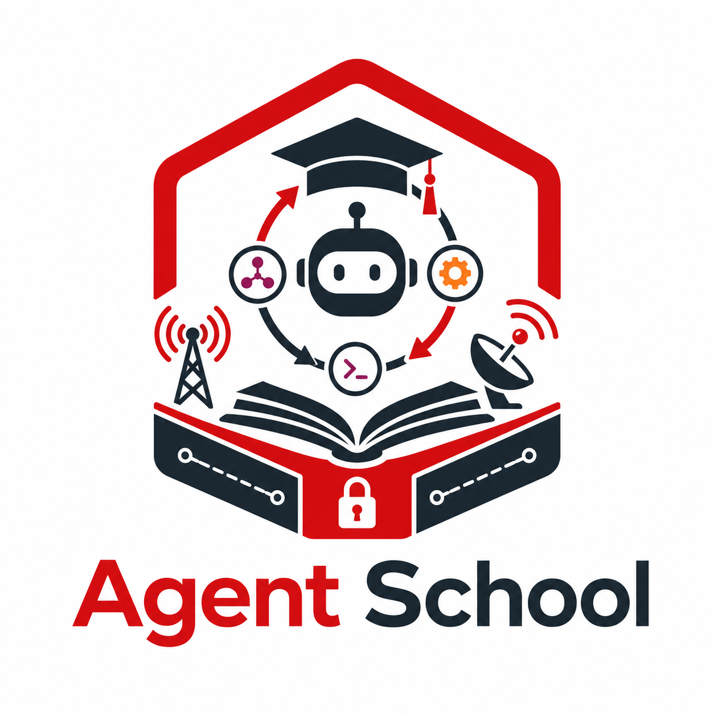

# Agent School

<p align="center">
  
</p>

Agentic AI solution implementation examples for telco, built to run on Red Hat OpenShift AI (RHOAI).

Each example takes a proven experiment from [Telco-AIX](https://github.com/open-experiments/Telco-AIX) and rebuilds it as a governed agent workload, following the solution architecture from our article *Agentic AI Stack Insideout*: the model is a stateless inference service, the harness owns the loop and the tool calls, and the sandbox runtime decides what the agent may touch.

## Quickstart

Two commands to a working agent, no model endpoint needed:

```bash
cd 101-noc-assistant && pip install -r requirements.txt
python3 agent/noc_agent.py --offline "What is wrong in the core right now?"
```

That replays a scripted agent episode over the real 5G core dataset, printing every plan step, tool call, and observation. When it makes sense, point the same agent at any OpenAI-compatible endpoint (`cp .env.example .env`, fill in `LLM_BASE_URL`/`LLM_API_KEY`/`LLM_MODEL`; endpoint options in [shared/manifests/vllm-rhoai.md](./shared/manifests/vllm-rhoai.md)) and run it live.

## Curriculum

| Course | Example | Status | Source experiment | Teaching harness (code) | Product harness track (config) | What it teaches |
|--------|---------|--------|-------------------|-------------------------|--------------------------------|-----------------|
| [101](./101-noc-assistant/) | NOC Assistant | **working, QA-passed** | 5gprod, telco-sme | custom loop (OpenAI-compatible) | [OpenClaw](./101-noc-assistant/harness-tracks/openclaw.md) | Agent loop, MCP tools, vLLM serving, tracing |
| [201](./201-rca-investigator/) | RCA Investigator | **working, QA-passed** | llm-rca | custom two-phase loop (OpenAI-compatible) | Hermes Agent (planned) | RAG as a skill backend, small-vs-large model routing |
| [202](./202-fraud-triage/) | Fraud Triage | **in progress** — model pipeline live on Rome | revenueassurance | LangGraph | — | Classic ML model as a tool, human-approval gate |
| [301](./301-closed-loop-netops/) | Closed-Loop NetOps | planned | autonet, agentic | LangGraph + A2A | NemoClaw + OpenShell | Multi-agent closed loop, ephemeral workers, externalized state |
| [302](./302-energy-optimizer/) | Energy Optimizer | planned | airan-energy, sustainability | Llama Stack | — | Simulate-before-act, batch job dispatch |

Courses are graded: 1xx runs in minutes on a laptop against any OpenAI-compatible endpoint; 2xx adds skill backends and routing; 3xx is the full closed loop on a cluster.

The harness column of our article's Table-1 mixes two species, and the
curriculum covers both. Teaching harnesses (the custom loops, LangGraph,
Llama Stack) are libraries: you write the agent and the loop is visible.
Product harnesses (OpenClaw, NemoClaw, Hermes Agent) are always-on systems
you configure: the same MCP skills plug in, and their loop takes over.
Every example's skills are MCP servers precisely so both species can drive
identical tools; that is the harness-agnosticism of the blueprint, made
testable.

## Conventions

These rules hold across every example, and they come straight from the blueprint:

1. **No GPU in the agent pod.** Agents are CPU-only loops; models are served by vLLM on RHOAI, and heavy skills run as separate services or batch jobs.
2. **Tools go through MCP.** Every capability an agent uses is exposed as an MCP tool, so tool authorization can move to a gateway without code changes.
3. **One agent, one process, one identity.** Examples are written so each agent can later run as one sandboxed pod with its own ServiceAccount or SPIFFE identity.
4. **Sessions are ephemeral.** Workflow state lives in files or stores outside the loop; any session can be restarted with a clean context (see our 12-Factor Agent article).
5. **Everything is traceable.** Agent loops print structured traces, and hook into MLflow/OpenTelemetry when configured.
6. **Claims carry evidence.** Every working course ships a `QA/` pack: deterministic offline runs, tool smoke tests, and live runs with wire-level request/response captures (auth redacted). If a course says it works, the logs are in the repo.

## Prerequisites

- Python 3.10+
- An OpenAI-compatible model endpoint for live runs: RHOAI Model-as-a-Service, a vLLM instance, local llama.cpp, or any hosted equivalent (see [shared/manifests/vllm-rhoai.md](./shared/manifests/vllm-rhoai.md)). Set `LLM_BASE_URL`, `LLM_API_KEY`, `LLM_MODEL`.
- Each working example also ships an `--offline` mode that runs a scripted episode with no endpoint, so the loop mechanics can be studied first.

## Layout

Every course folder follows the same shape, so once you have read 101 you can navigate any of them:

```
agent-school/
├── 101-noc-assistant/        # working: agent + MCP tools + real 5gprod data + runbooks
│   ├── agent/                #   the teaching harness (readable tool-calling loop)
│   ├── tools/                #   skills: in-process lib + stdio MCP servers
│   ├── data/  runbooks/      #   real Telco-AIX dataset and matching runbooks
│   ├── harness-tracks/       #   same skills under product harnesses (OpenClaw)
│   ├── deploy/               #   Containerfile + OpenShift manifests (Job/CronJob)
│   ├── QA/                   #   evidence pack: logs + wire traces
│   └── images/               #   architecture drawing
├── 201-rca-investigator/     # working: two-phase RCA agent + RAG service backend
│   ├── agent/  tools/        #   as above
│   ├── backend/              #   pattern-2 skill backend (FastAPI RAG service)
│   ├── deploy/  QA/  images/ #   as above (Deployment+Service for the backend)
│   └── reports/              #   cited RCA artifacts from QA runs
├── 202-fraud-triage/         # in progress: pipeline/ + deploy/ live on Rome, agent next
├── 301-closed-loop-netops/   # planned: solution README + architecture
├── 302-energy-optimizer/     # planned: solution README + architecture
└── shared/                   # endpoint options, OCP secret template
```

## Deploy on OpenShift

101 and 201 ship `deploy/` folders: UBI9 Containerfiles, ImageStream + BuildConfig for in-cluster builds, and restricted-PSS manifests with the right workload shapes (agents as Jobs/CronJobs, backends as Deployment + Service). One `llm-credentials` Secret serves all courses ([shared/manifests/ocp/secret-llm.example.yaml](./shared/manifests/ocp/secret-llm.example.yaml)). Start at [101-noc-assistant/deploy/](./101-noc-assistant/deploy/).

## License

[MIT](./LICENSE).
